# ARO HCP reference deployment architecture

This document describes the Azure, Entra, and OpenShift resources that result from this repository after `make cluster.<name>.apply` (and optionally kubeconfig, external-auth, and GitOps bootstrap). Names below use the defaults from [`clusters/public/terraform.tfvars`](../clusters/public/terraform.tfvars). Substitute your `terraform.tfvars` values when reading the Azure portal.

This is a **customer-side** reference. Terraform provisions prerequisites, the HCP cluster, and the default node pool via AzAPI (`2026-06-30-preview`). Bash wrappers call `az aro hcp` for credentials, extra node pools, and external-auth. Optional GitOps installs in-cluster operators from [`gitops/`](../gitops/). The hosted control plane itself runs in the ARO HCP service, not as VMs in the customer subscription.

**Operator guides:** [Documentation site](https://rh-mobb.github.io/validated-pattern-aro-hcp/) · [Account prerequisites](prerequisites/account.md) · [Full-stack deployment and per-step permissions](prerequisites/full-stack.md) · [External auth with Entra ID](guides/external-auth-entra-id.md) · [GitOps bootstrap](guides/gitops.md)

Diagrams are [Mermaid](https://mermaid.js.org/) and render on GitHub.

## Contents

- [Trust boundary](#trust-boundary)
- [Network privacy](#network-privacy)
- [Deploy pipeline](#deploy-pipeline)
- [Operator permissions](#operator-permissions)
- [Resultant resources](#resultant-resources)
- [Customer resource group](#customer-resource-group)
- [Network](#network)
- [Jump box (optional)](#jump-box-optional)
- [Key Vault and etcd KMS](#key-vault-and-etcd-kms)
- [Identities and RBAC](#identities-and-rbac)
- [Cluster ARM resource](#cluster-arm-resource)
- [Default node pool](#default-node-pool)
- [Managed resource group](#managed-resource-group)
- [Credentials and optional Entra](#credentials-and-optional-entra)
- [GitOps (optional)](#gitops-optional)
- [Lifecycle](#lifecycle)
- [Ownership matrix](#ownership-matrix)

## Trust boundary

ARO HCP splits the classic ARO model: the control plane is hosted by the service; workers stay in the customer VNet.

| Aspect | This deployment |
|--------|-----------------|
| Control plane | Service-owned management cluster. No control-plane VMs in the customer subscription. |
| Worker nodes | Customer subscription. NICs attach to the customer worker subnet. Compute objects live in the managed resource group. |
| Cluster ARM handle | `Microsoft.RedHatOpenShift/hcpOpenShiftClusters` in the **customer** resource group. |
| Data-plane Azure objects | Managed resource group (`managed_resource_group_name`), created and locked by the resource provider. |
| Minimum workers | 2 replicas of `Standard_D4s_v6` by default (8 vCPU quota). When `enable_jumpbox = true`, add **+2 vCPU** of `Standard_D2s_v6`. |

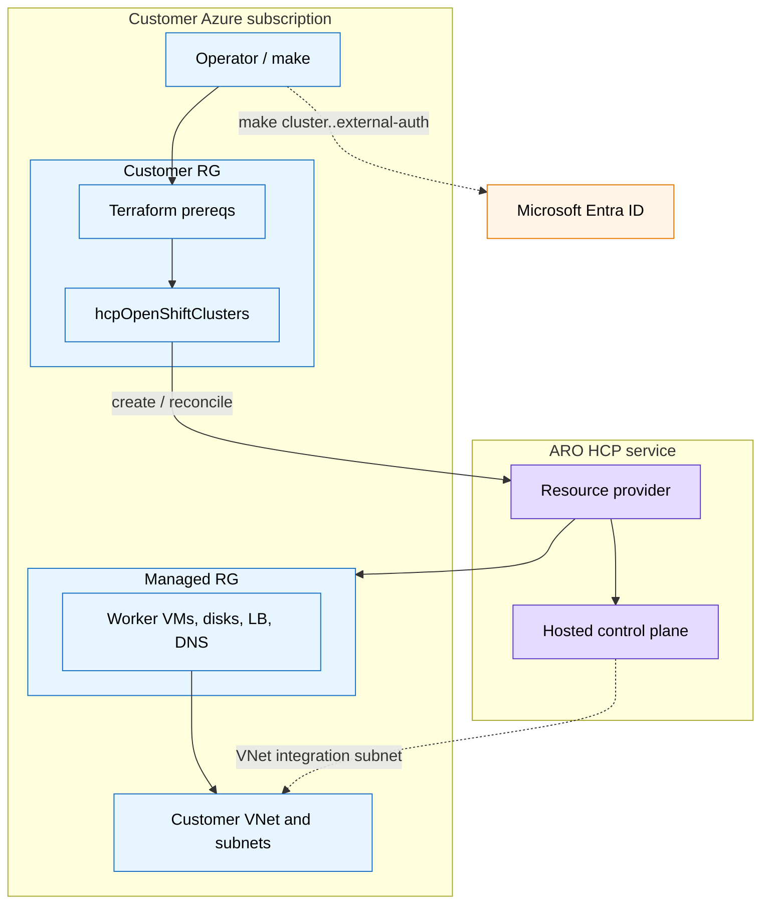

Dashed lines are supporting or optional paths.

## Network privacy

**Rule:** Traffic this pattern owns must stay on **RFC1918** or **Azure Private Endpoints**. Anything that is not, or cannot be, needs an **approved, documented exception** in the table below **in the same change** that introduces it.

ANF NFS (sibling) is the model to copy: a delegated subnet on the cluster VNet, volumes with private IPs, no Private Endpoint. Private Endpoint is required only when the Azure service has no VNet-native RFC1918 data path.

`clusters/public` still defaults API and ingress to `Public` so the first deploy is reachable. That is an exception, not the philosophy. `clusters/private` is the philosophy-aligned profile.

### Compliant (no exception)

| Path | How it stays private |
|------|----------------------|
| Worker, pod, and service CIDRs | RFC1918 overlays in the customer VNet |
| HCP VNet integration subnet | RFC1918; hosted control plane private connectivity into the customer VNet |
| ANF NFS (sibling `modules/azure`) | Delegated subnet `10.0.3.0/24` (installer `netapp_subnet_prefix`). Volumes get VNet IPs. **Not** a Private Endpoint. |
| Azure Route Server BGP data plane (sibling) | RFC1918 `virtualRouterIps` on `RouteServerSubnet` (`10.0.4.0/26`, installer `route_server_subnet_prefix`). Speaker NICs and CUDN stay in the VNet. |
| Jump NIC | RFC1918 `10.0.2.0/28`. The public IP on that NIC is the exception below. |

### Approved exceptions

| Path | Why it is not RFC1918 / PE | Why it is allowed | How to tighten |
|------|----------------------------|-------------------|----------------|
| Cluster API (`api.visibility` default `Public`) | Public `*.aroapp-hcp.io` | Example profile `clusters/public`; create-time immutable | `api_visibility = Private` (`clusters/private`) |
| Ingress / console (`ingress.type` default `Public`) | Public `*.apps` | Same | `ingress_visibility = Private` |
| Node outbound (`outboundType = LoadBalancer`) | Public IP on the managed-RG load balancer | HCP preview default; nodes must pull images and reach Azure / Red Hat | Track platform support for private egress; do not treat this as RFC1918 |
| Key Vault / etcd KMS (`kms.visibility: Public`) | Vault public network access; no PE or `privatelink.vaultcore.azure.net` | HCP customer-managed KMS consumes a public vault today | Demo Bicep can private-link the vault; this repo has not |
| Jump box public IP | SSH from the operator network | Optional (`enable_jumpbox`); NSG sourced to `jump_ssh_source_prefix` | Bastion, PE jump, or an existing VNet path |
| Azure Route Server Standard public IP (sibling) | Azure requires a PIP for SDN management of Route Server; not a customer BGP listener | Sibling virt stack creates it with Route Server. BGP neighbors are RFC1918 `virtualRouterIps` | None; required by the Azure service |
| Microsoft Entra ID / Graph | SaaS, not VNet-injectable as RFC1918 | Identity plane for console OIDC | None; keep as exception |
| Azure Resource Manager (Terraform, `az`, Trident CSI) | Public ARM HTTPS | Azure control plane | ARM Private Link is not in this pattern |
| Image pulls, OperatorHub, GitOps `github.com` | Public HTTPS | Cluster must fetch payload and git | Private registry / GHES later; add a row if you keep them public |

Do not add a public IP, public PaaS data plane, or internet listener without a new row here.

## Deploy pipeline

`make` is the interface. Cluster and default node-pool create are AzAPI resources, **not** Terraform `local-exec`.

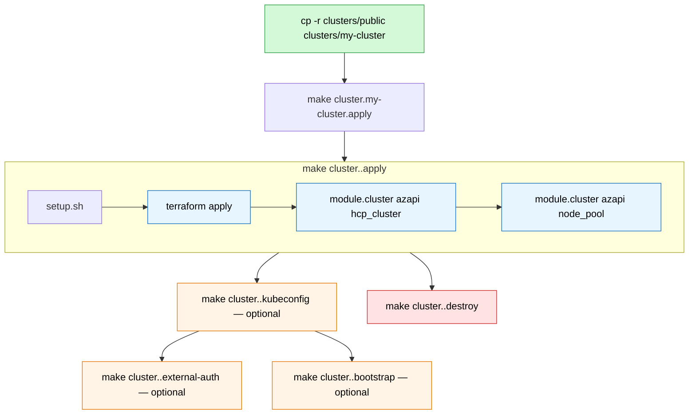

| Stage | Tool | What it creates |
|-------|------|-----------------|
| `make setup` | `scripts/setup.sh` | Installs the `az aro hcp` CLI extension. No Azure resources. |
| `make cluster.<name>.apply` | Terraform `azurerm` + `azapi` + `azuread` | Customer RG, network, Key Vault, etcd key, optional `redhat-pull-secret`, 13 HCP identities, ESO workload identity + federated credential, CAPI federated credential for bgp-cloud-connector, 28 operator role assignments + Key Vault Secrets User for ESO, `hcpOpenShiftClusters`, `nodePools` from `node_pools` (default `np-1`), Entra app + `externalAuths/entra` + Key Vault client secret (unless `enable_external_auth = false`). |
| `make cluster.<name>.kubeconfig` | `az aro hcp cluster request-credential` | Local `.kube/config` only. Admin credential TTL is 24 hours. |
| `make cluster.<name>.external-auth` | `oc` + optional Entra fallback | Console secret in `openshift-config`, break-glass `cluster-admin` CRB, GitOps OIDC patch. When Terraform already created the app, does **not** create or rotate Entra. |
| `make cluster.<name>.bootstrap` | `oc apply -k` + Argo `Application` | OpenShift GitOps, Web Terminal, Compliance Operator, External Secrets Operator; ConfigMap `openshift-gitops/aro-platform-metadata` (ESO client ID + vault URI from Terraform outputs); `kube-system/additional-pull-secret` from Key Vault `redhat-pull-secret` (or `PULL_SECRET_PATH`); root app syncs [`gitops/overlays/public`](../gitops/overlays/public/) or [`private`](../gitops/overlays/private/) (from `api_visibility`, or `GITOPS_OVERLAY`). |

`make cluster.<name>.plan` / `apply` / `destroy` pass `clusters/<name>/terraform.tfvars` with `-var-file`. Scripts after apply read terraform outputs, then fall back to the same file.

## Operator permissions

Step-by-step least-privilege tables for every `make cluster.<name>.*` target: **[Full-stack deployment — permissions by step](prerequisites/full-stack.md#permissions-by-deployment-step)**. Entra OIDC detail: **[External auth with Entra ID](guides/external-auth-entra-id.md)**.

Permissions fall into three planes. Azure RBAC on the subscription does **not** grant Microsoft Entra directory rights, and the reverse is also true.

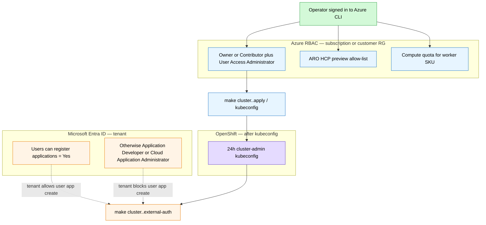

### Azure RBAC — `make cluster.<name>.apply`, `destroy`, `kubeconfig`

| Requirement | Why |
|-------------|-----|
| **Owner**, or **Contributor** + **User Access Administrator**, on the subscription or customer RG | Contributor can create RG, network, Key Vault, identities, and the HCP ARM resource. It **cannot** create role assignments. Terraform writes 28 operator assignments plus Key Vault Administrator for the deployer. That needs `Microsoft.Authorization/roleAssignments/write` (User Access Administrator or Owner). |
| Resource providers registered | At minimum `Microsoft.RedHatOpenShift`. Terraform’s azurerm provider also auto-registers providers it uses (`Microsoft.Network`, `Microsoft.KeyVault`, `Microsoft.ManagedIdentity`, `Microsoft.Authorization`). Registering a provider is a **subscription** action; RG-only Contributor cannot do it if the provider is not already registered. |
| ARO HCP preview **allow-list** | Not an Azure role. The subscription must be enrolled for the preview or cluster create fails regardless of RBAC. |
| Quota | Default node pool is `Standard_D4s_v6` × 2 = **8 vCPU** in `location`. When `enable_jumpbox = true`, add **+2 vCPU** of `Standard_D2s_v6`. `clusters/aro-virt` `node_pools.np-virt` adds **+16 vCPU** `Standard_D8s_v6`. |

RG-scoped Owner / Contributor+UAA is enough for this repo because VNet, NSG, Key Vault, identities, and the cluster all live in one RG. A pre-existing VNet in another RG would also need UAA (or Owner) on that VNet.

`make cluster.<name>.kubeconfig` (`requestAdminCredential`) needs Contributor (or higher) on the cluster resource. It does not need Entra admin roles.

`make cluster.<name>.bootstrap` needs **Key Vault Secrets User** (or the deployer’s **Key Vault Administrator**) on the customer vault to `get` `redhat-pull-secret`, plus OpenShift `cluster-admin`. Skip the vault get if `PULL_SECRET_PATH` is set or `kube-system/additional-pull-secret` already exists. That is extra Azure RBAC only when GitOps is split from apply.

Typical failure if UAA is missing:

```text
AuthorizationFailed: The client does not have authorization to perform action
'Microsoft.Authorization/roleAssignments/write'
```

### Microsoft Entra ID — `make cluster.<name>.external-auth`

The script calls `az ad app create`, `az ad sp create`, `az ad app update` (redirect URIs + optional `groups` claims), `az ad app credential reset`, and on destroy `az ad app delete`. Those are **directory** operations. Subscription Owner does **not** imply them.

**You do not need Global Administrator.** You also do **not** always need Application Administrator.

| Tenant setting | What the operator needs |
|----------------|-------------------------|
| Entra ID → Users → User settings → **Users can register applications** = **Yes** (common default) | No directory admin role. The operator creates the app, becomes **owner**, and can set claims, create a client secret, create the service principal, and delete the app. |
| That setting = **No** (typical locked-down enterprise tenant) | A directory role that can create app registrations. Least privilege: **Application Developer** (creates apps they own, including when user registration is disabled). Broader: **Cloud Application Administrator** or **Application Administrator** (can manage **all** apps in the tenant and add credentials to them — treat as privileged). |

[Application Developer](https://learn.microsoft.com/entra/identity/role-based-access-control/permissions-reference#application-developer) is the role Microsoft documents for “create app registrations when Users can register applications is No.” [Cloud Application Administrator](https://learn.microsoft.com/entra/identity/role-based-access-control/permissions-reference#cloud-application-administrator) is the least-privilege role for creating enterprise applications tenant-wide; it is more power than this script needs.

What this script **does not** do (unlike some hackathon steps):

- It does **not** add Microsoft Graph application permissions (`az ad app permission add`).
- It does **not** request admin consent for Graph APIs.
- It authenticates users with `preferred_username`, not an `email` Graph claim.

So **Application Administrator is not required** for the default path, and **tenant-wide admin consent for Microsoft Graph is not required** for the default path.

Still required or commonly blocked:

| Check | Why |
|-------|-----|
| Azure CLI Microsoft Graph consent | `az ad *` uses Graph as the signed-in user (typically `Application.ReadWrite.All` delegated). First run may prompt consent. If the tenant sets **Do not allow user consent**, a Cloud Application Administrator (or Global Administrator) must grant admin consent to **Azure CLI** for those Graph scopes — that is consent for the CLI, not for the cluster’s OIDC app. |
| First console / `oc login` | Users may see “Permissions requested” for OpenID/`profile`. They can accept if user consent is allowed. If user consent is disabled, an admin must consent to **this** app (openid/profile), which is still not Application Administrator if someone else already created the app. |
| `scripts/external-auth.sh rbac-group` / `GROUP_ID=` on create | Needs the Entra **group object ID**. Looking groups up may need Group Reader / Directory Reader. Prefer a cluster-config GitOps Group binding over `GROUP_ID=` when Argo owns `entra-cluster-admin-group`. |

If an admin must create the app on the operator’s behalf: create the app registration, add the operator as **owner**, then the operator can run `make cluster.<name>.external-auth` (the script reuses `CLIENT_ID` from `.external-auth/state.env`). They still need owner (or a directory role) to run `az ad app credential reset`.

Typical failures:

```text
Authorization_RequestDenied / Insufficient privileges to complete the operation
```

on `az ad app create` or `az ad app credential reset` → user registration disabled and no Application Developer / Cloud Application Administrator (or not owner of an existing app).

```text
AADSTS65001: The user or administrator has not consented
```

→ Azure CLI Graph scopes or the OIDC app need consent, not Azure RBAC.

### OpenShift RBAC — console secret and `ClusterRoleBinding`

`make cluster.<name>.external-auth` applies a secret in `openshift-config` and, when kubeconfig is present, binds the signed-in Entra user as OpenShift `cluster-admin` (`entra-cluster-admin`) unless `SKIP_RBAC_USER=1`. That user binding is break-glass (console/OIDC before GitOps syncs, and if Argo is down). Fleet admins are a **Group** binding (`entra-cluster-admin-group`) in a [cluster-config GitOps overlay](guides/gitops.md#cluster-config-repo) — not this installer’s `gitops/`. Optional `GROUP_ID=` is a one-shot bash apply of that same group binding; do not use it when GitOps already owns the object. Create uses the **24h admin kubeconfig**, not Entra directory roles. Run `make cluster.<name>.kubeconfig` first.

Granting `cluster-admin` to an Entra user or group is OpenShift RBAC (`oc apply`). It does not change Azure or Entra admin roles.

### Permissions by `make` target

Summary — full Azure action list and split-role options: [Full-stack deployment](prerequisites/full-stack.md#permissions-by-deployment-step).

| Target | Azure RBAC (minimum) | Entra directory | OpenShift |
|--------|----------------------|-----------------|-----------|
| `make setup` | None | None | None |
| `make cluster.<name>.jump-key` | None | None | None |
| `make cluster.<name>.versions` | Reader on subscription | None | None |
| `make cluster.<name>.init` | None | None | None |
| `make cluster.<name>.plan` | Reader on subscription + customer RG | None | None |
| `make cluster.<name>.apply` | Contributor + UAA (or Owner) on customer RG; subscription Contributor once if RPs not registered | None | None |
| `make cluster.<name>.kubeconfig` / `revoke-credentials` | Contributor on cluster (or RG) | None | None |
| `make cluster.<name>.external-auth` | Contributor on cluster (`externalAuths` write) | App create + credential reset — see [Entra guide](guides/external-auth-entra-id.md) | Admin kubeconfig (24h) for console secret |
| `make cluster.<name>.external-auth-delete` | Contributor on cluster | App owner or directory role for `az ad app delete` | Optional admin kubeconfig to delete secret |
| `make cluster.<name>.jump` | None | None | None |
| `make cluster.<name>.destroy` | Same as apply | Same as external-auth-delete if cleaning Entra app | Optional admin kubeconfig |
| `scripts/nodepool.sh` (extra pools) | Contributor on cluster (`nodePools` write) | None | None |

## Resultant resources

After a successful `make cluster.<name>.apply`, the customer subscription contains two resource groups. Example names:

| Resource group | Example name | Created by | Purpose |
|----------------|--------------|------------|---------|
| Customer | `my-cluster-rg` | Terraform | Network, Key Vault, identities, RBAC, cluster ARM resource, node-pool child resource. |
| Managed | `my-cluster-managed` | ARO HCP resource provider | Worker compute and service-owned Azure objects. Deny assignment blocks customer writes. |

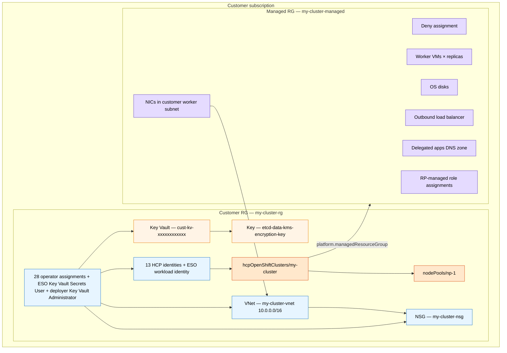

Exact object names inside the managed RG are chosen by the resource provider and HyperShift. Treat that group as opaque: inspect it, do not edit it.

## Customer resource group

Terraform resources live under [`modules/`](../modules/) (composed by [`terraform/`](../terraform/)). HCP identity count and operator assignment count are asserted in [`modules/identities/identities.tftest.hcl`](../modules/identities/identities.tftest.hcl) (13 HCP identities, 28 operator assignments). The ESO workload identity is extra and is not attached to the cluster ARM resource.

### Inventory

| Azure type | Default / pattern | Terraform address | Notes |
|------------|-------------------|-------------------|-------|
| Resource group | `my-cluster-rg` | `azurerm_resource_group.this` | Location from `location`. Tag `project=aro-hcp-reference`. Default `${cluster_name}-rg`. |
| Network security group | `my-cluster-nsg` | `azurerm_network_security_group.this` | Associated only with the worker subnet. Empty of custom rules; operators may add rules later. Default `${cluster_name}-nsg`. |
| Virtual network | `my-cluster-vnet` | `azurerm_virtual_network.this` | Address space `10.0.0.0/16`. Default `${cluster_name}-vnet`. |
| Subnet | `my-cluster-worker` | `azurerm_subnet.worker` | Worker subnet `10.0.0.0/24`. Private endpoint policies disabled. Default outbound access enabled. Default `${cluster_name}-worker`. |
| Subnet NSG association | — | `azurerm_subnet_network_security_group_association.worker` | Binds the customer NSG to the worker subnet. |
| Subnet | `my-cluster-integration` | `azapi_resource.vnet_integration_subnet` | `10.0.1.0/24`. Delegated to `Microsoft.RedHatOpenShift/hcpOpenShiftClusters`. Created via AzAPI because the azurerm provider cannot express this delegation. Default `${cluster_name}-integration`. |
| Subnet | `customer-jump-subnet` | `module.jumpbox[].azurerm_subnet.jump` | `10.0.2.0/28`. Optional. Only created when `enable_jumpbox = true`. |
| NSG | `customer-jump-nsg` | `module.jumpbox[].azurerm_network_security_group.jump` | SSH 22 from `jump_ssh_source_prefix` only. Only created when `enable_jumpbox = true`. |
| Public IP | `${cluster_name}-jump-pip` | `module.jumpbox[].azurerm_public_ip.jump` | Standard static, on the jump NIC. Only created when `enable_jumpbox = true`. |
| Linux VM | `${cluster_name}-jump` | `module.jumpbox[].azurerm_linux_virtual_machine.jump` | Fedora Cloud, `Standard_D2s_v6`, admin `fedora`. Only created when `enable_jumpbox = true`. |
| Key Vault | `cust-kv-` + 13-char random | `azurerm_key_vault.this` | RBAC authorization, public network access, soft-delete 7 days, purge protection off. |
| Key Vault key | `etcd-data-kms-encryption-key` | `azurerm_key_vault_key.etcd_encryption` | RSA 2048; wrap/unwrap/encrypt/decrypt/sign/verify. |
| Key Vault secret | `redhat-pull-secret` | `azurerm_key_vault_secret.pull_secret` | Optional. Created when `pull_secret_path` / `PULL_SECRET_PATH` is set. Dockerconfigjson for OperatorHub; value is never a Terraform output. |
| User-assigned identity × 13 | `${cluster_name}-…` | `azurerm_user_assigned_identity.*` | HCP operators. See [Identities and RBAC](#identities-and-rbac). |
| User-assigned identity × 1 | `${cluster_name}-eso` | `azurerm_user_assigned_identity.eso` | External Secrets Operator workload identity. Not in `cluster_identity_ids`. |
| Role assignment × 28 | — | `azurerm_role_assignment.this` | Operator RBAC for cluster managed identities. |
| Role assignment × 1 | Key Vault Secrets User | `azurerm_role_assignment.eso_key_vault_secrets_user` | ESO identity on the customer vault. |
| Federated identity credential × 2 | `eso-external-secrets`, `capi-bgp-cloud-connector` | `azurerm_federated_identity_credential.eso`, `azurerm_federated_identity_credential.bgp_cloud_connector` | ESO trusts `system:serviceaccount:external-secrets-operator:external-secrets-sa`. CAPI trusts `system:serviceaccount:openshift-bgp-cloud-connector:openshift-bgp-cloud-connector-controller-manager` so the sibling BGP operator can token-exchange for NIC IP forwarding. |
| Role assignment × 1 | Key Vault Administrator | `azurerm_role_assignment.deployer_key_vault_admin` | Deployer object ID so Terraform can create the etcd key and optional pull secret. |
| HCP cluster | `my-cluster` | `azapi_resource.hcp_cluster` | `hcpOpenShiftClusters@2026-06-30-preview`. `schema_validation_enabled = false`. Timeouts 120m. |
| Node pool | `node_pools` keys (default `np-1`) | `azapi_resource.node_pool` (`for_each`) | Child `nodePools`. Last-pool DELETE is blocked (OCPBUGS-86702); destroy state-rms all instances first. |

This reference **does not** create a private Key Vault, private endpoint, or `privatelink.vaultcore.azure.net` zone. That is a documented [network privacy](#network-privacy) exception. The demo Bicep in `references/` can; this repo sets etcd KMS `visibility` to `Public`.

## Network

See [Network privacy](#network-privacy) for the RFC1918 / Private Endpoint rule and the exception table.

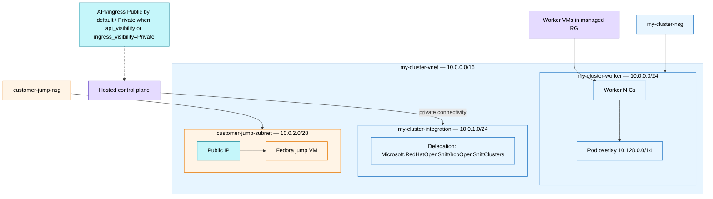

| CIDR | Role | Source |
|------|------|--------|
| `10.0.0.0/16` | VNet / machine CIDR | Terraform `address_prefix`; ARM network default `machineCidr` |
| `10.0.0.0/24` | Worker subnet | Terraform `subnet_prefix`; cluster `platform.subnetId` |
| `10.0.1.0/24` | VNet integration subnet | Terraform `vnet_integration_subnet_prefix`; cluster `platform.vnetIntegrationSubnetId` |
| `10.0.2.0/28` | Jump subnet | Terraform `jump_subnet_prefix`; optional `enable_jumpbox` |
| `10.0.3.0/24` | Reserved ANF delegated subnet | Terraform `netapp_subnet_prefix`. **Not created here.** Sibling virt/storage stack ([issue #16](https://github.com/rh-mobb/validated-pattern-aro-hcp/issues/16)) consumes this CIDR. NFS data plane is RFC1918 in-VNet (not a Private Endpoint). |
| `10.0.4.0/26` | Reserved Azure Route Server subnet | Terraform `route_server_subnet_prefix`. **Not created here.** Sibling creates subnet **`RouteServerSubnet`** (Azure-required name, no NSG/UDR). BGP data plane is RFC1918; the sibling also creates a Standard public IP (management plane — exception above). |
| `10.128.0.0/14` | Pod CIDR | Terraform `pod_cidr` (ARM default) |
| `172.30.0.0/16` | Service CIDR | Terraform `service_cidr` (ARM default) |

Terraform sets `network.podCidr`, `network.serviceCidr`, `network.machineCidr`, and `network.hostPrefix` on the AzAPI cluster body.

**Outbound:** `platform.outboundType` defaults to `LoadBalancer`. The load balancer is created in the managed resource group.

**API visibility:** `Public` by default. Set `api_visibility = "Private"` in `terraform.tfvars` (create-time, immutable). **Ingress / console:** `Public` by default. Set `ingress_visibility = "Private"` for a private default ingress (console and `*.apps`). Private kube-apiserver and private ingress require a path into the VNet (this repo’s jump + sshuttle, or your own). `platform.outboundType` remains `LoadBalancer` (outbound public IP in the managed RG still exists).

**VNet integration subnet** is required for hosted-control-plane private connectivity into the customer VNet. It must remain delegated; do not place worker NICs on it.

### Jump box (optional)

Independent of API visibility. When `enable_jumpbox = true`, Terraform module [`modules/jumpbox`](../modules/jumpbox) creates a Fedora Cloud VM on `customer-jump-subnet` (`10.0.2.0/28`) with a Standard public IP and NSG allowing SSH 22 only from `jump_ssh_source_prefix`.

1. `make cluster.<name>.jump-key` — writes gitignored `clusters/<name>/jump` + `jump.pub` (plan/apply require the `.pub` when jump is on).
2. Set `enable_jumpbox = true` and `jump_ssh_source_prefix` (your `/32`) in `terraform.tfvars`.
3. `make cluster.<name>.apply` — provisions subnet, NSG, PIP, NIC, and VM (`Standard_D2s_v6`, admin `fedora`, Trusted Launch). Image default: `/communityGalleries/Fedora-5e266ba4-2250-406d-adad-5d73860d958f/images/Fedora-Cloud-44-x64/versions/latest`.
4. `make cluster.<name>.jump` — prints the foreground sshuttle command. Prefer `make cluster.<name>.sshuttle.connect` to start sshuttle in the background (`clusters/<name>/sshuttle.pid`); `make cluster.<name>.sshuttle.disconnect` stops it.
5. `make cluster.<name>.kubeconfig` still uses ARM (`requestAdminCredential`); only `oc` / API hostname traffic needs sshuttle when the API is private.
6. `make cluster.<name>.private-dns` — creates a customer-RG Private DNS zone (VNet-linked) with `api` → managed `hypershift.local` IP, optional `*.apps` when the ingress router internal LB IP is found, and writes `clusters/<name>/operator-hosts.snippet` for `/etc/hosts` when public DNS still resolves `*.aroapp-hcp.io`.

API hostname is `https://api.<id>.<region>.aroapp-hcp.io:443`. sshuttle `--dns` alone may not route `oc` correctly if the laptop still resolves public `aroapp-hcp.io` addresses — use **private-dns** and the hosts snippet as above.

Quota: **+2 vCPU** of `Standard_D2s_v6` in `location` when the jump is enabled.

## Key Vault and etcd KMS

AzAPI cluster body (`properties.etcd.dataEncryption`):

```text
keyManagementMode: CustomerManaged
encryptionType: KMS
kms.vaultName: <azurerm_key_vault.this.name>
kms.visibility: Public
kms.activeKey.name: etcd-data-kms-encryption-key
kms.activeKey.version: <azurerm_key_vault_key.etcd_encryption.version>
```

The KMS identity (`${cluster_name}-kms`) has **Key Vault Crypto User** on the vault. The cluster resource is created only after that assignment exists.

Optional **Red Hat pull secret**: when `pull_secret_path` is set (or Make exports `TF_VAR_pull_secret_path` from `PULL_SECRET_PATH`), Terraform writes a Key Vault secret named `redhat-pull-secret` (`pull_secret_key_vault_secret_name`). The dockerconfigjson is stored in Terraform state as a sensitive value; outputs expose only the vault name and secret name. Clearing `pull_secret_path` after upload **deletes** that Key Vault secret on the next apply — keep the path set while Terraform should manage it. Example profiles use `../tmp/pull-secret.txt` (resolved from `terraform/`; `tmp/` is gitignored).

`make cluster.<name>.bootstrap` reads that Key Vault secret (`az keyvault secret show`) and applies `kube-system/additional-pull-secret` once so OperatorHub can start. After GitOps is up, External Secrets Operator refreshes the same secret from Key Vault using the ESO workload identity (see [GitOps](#gitops-optional)). `PULL_SECRET_PATH` on bootstrap still wins as an override. HCP has no classic ARO `clusterProfile.pullSecret`; do not patch `openshift-config/pull-secret`.

Terraform sets `purge_soft_delete_on_destroy = true` on the azurerm provider so `make cluster.<name>.destroy` can purge the vault. Redeploying without purge can collide on the random vault name only if a soft-deleted vault with the same name still exists.

## Identities and RBAC

Thirteen **HCP** user-assigned identities (service + 9 control-plane operators + 3 data-plane operators). Names are `${cluster_name}-<role>` with **no** random suffix (unlike older demo Bicep). A fourteenth identity `${cluster_name}-eso` is for External Secrets Operator only; it is not in `cluster_identity_ids` and is not passed to the cluster ARM resource.

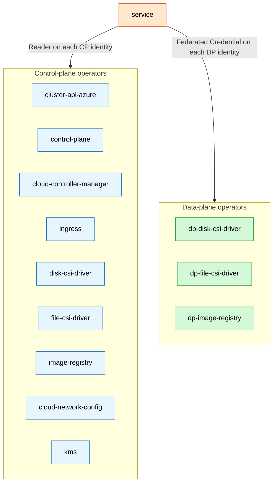

`--user-assigned-identities` on cluster create includes the **service + 9 CP** identities only. The three data-plane identities are referenced solely under `operatorsAuthentication.userAssignedIdentities.dataPlaneOperators`, matching the demo ARM body.

### Identity catalog

| Local key | Azure name | OperatorsAuthentication slot |
|-----------|------------|------------------------------|
| `service` | `${cluster_name}-service` | `serviceManagedIdentity` |
| `cluster_api_azure` | `${cluster_name}-cluster-api-azure` | CP `cluster-api-azure` |
| `control_plane` | `${cluster_name}-control-plane` | CP `control-plane` |
| `cloud_controller_manager` | `${cluster_name}-cloud-controller-manager` | CP `cloud-controller-manager` |
| `ingress` | `${cluster_name}-ingress` | CP `ingress` |
| `disk_csi_driver` | `${cluster_name}-disk-csi-driver` | CP `disk-csi-driver` |
| `file_csi_driver` | `${cluster_name}-file-csi-driver` | CP `file-csi-driver` |
| `image_registry` | `${cluster_name}-image-registry` | CP `image-registry` |
| `cloud_network_config` | `${cluster_name}-cloud-network-config` | CP `cloud-network-config` |
| `kms` | `${cluster_name}-kms` | CP `kms` |
| `dp_disk_csi_driver` | `${cluster_name}-dp-disk-csi-driver` | DP `disk-csi-driver` |
| `dp_file_csi_driver` | `${cluster_name}-dp-file-csi-driver` | DP `file-csi-driver` |
| `dp_image_registry` | `${cluster_name}-dp-image-registry` | DP `image-registry` |
| `eso` | `${cluster_name}-eso` | Not an HCP operator. GitOps workload identity for External Secrets Operator. |

### Built-in role GUIDs

From [`modules/identities/locals.tf`](../modules/identities/locals.tf):

| Local key | Role definition GUID |
|-----------|----------------------|
| `service_managed_identity` | `c0ff367d-66d8-445e-917c-583feb0ef0d4` |
| `cluster_api_provider` | `88366f10-ed47-4cc0-9fab-c8a06148393e` |
| `control_plane_operator` | `fc0c873f-45e9-4d0d-a7d1-585aab30c6ed` |
| `cloud_controller_manager` | `a1f96423-95ce-4224-ab27-4e3dc72facd4` |
| `ingress_operator` | `0336e1d3-7a87-462b-b6db-342b63f7802c` |
| `file_storage_operator` | `0d7aedc0-15fd-4a67-a412-efad370c947e` |
| `image_registry_operator` | `8b32b316-c2f5-4ddf-b05b-83dacd2d08b5` |
| `network_operator` | `be7a6435-15ae-4171-8f30-4a343eff9e8f` |
| `key_vault_crypto_user` | `12338af0-0e69-4776-bea7-57ae8d297424` |
| `key_vault_secrets_user` | `4633458b-17de-408a-b874-0445c86b69e6` |
| `reader` | `acdd72a7-3385-48ef-bd42-f606fba81ae7` |
| `federated_credential` | `ef318e2a-8334-4a05-9e4a-295a196c6a6e` |

### Operator role assignments

CAPI, CCM, ingress, file CSI, and image registry are assigned on the **VNet** (and NSG where listed), **not** the worker subnet. Older Bicep in `references/` still uses subnet scope for some of those roles — do not copy it.

| Key | Principal | Role | Scope |
|-----|-----------|------|-------|
| `service-vnet` | service | Service managed identity | VNet |
| `service-nsg` | service | Service managed identity | NSG |
| `capi-vnet` | cluster-api-azure | Cluster API provider | VNet |
| `service-reader-capi` | service | Reader | cluster-api-azure identity |
| `cp-vnet` | control-plane | Control plane operator | VNet |
| `cp-nsg` | control-plane | Control plane operator | NSG |
| `service-reader-cp` | service | Reader | control-plane identity |
| `ccm-vnet` | cloud-controller-manager | Cloud controller manager | VNet |
| `ccm-nsg` | cloud-controller-manager | Cloud controller manager | NSG |
| `service-reader-ccm` | service | Reader | cloud-controller-manager identity |
| `ingress-vnet` | ingress | Ingress operator | VNet |
| `service-reader-ingress` | service | Reader | ingress identity |
| `service-reader-disk-csi` | service | Reader | disk-csi-driver identity |
| `file-csi-vnet` | file-csi-driver | File storage operator | VNet |
| `file-csi-nsg` | file-csi-driver | File storage operator | NSG |
| `service-reader-file-csi` | service | Reader | file-csi-driver identity |
| `image-reg-vnet` | image-registry | Image registry operator | VNet |
| `service-reader-image-reg` | service | Reader | image-registry identity |
| `cloud-net-subnet` | cloud-network-config | Network operator | Worker subnet |
| `cloud-net-vnet` | cloud-network-config | Network operator | VNet |
| `service-reader-cloud-net` | service | Reader | cloud-network-config identity |
| `kms-kv` | kms | Key Vault Crypto User | Key Vault |
| `service-reader-kms` | service | Reader | kms identity |
| `service-fed-dp-disk` | service | Federated credential | dp-disk-csi-driver identity |
| `service-fed-dp-file` | service | Federated credential | dp-file-csi-driver identity |
| `service-fed-dp-image` | service | Federated credential | dp-image-registry identity |
| `dp-file-subnet` | dp-file-csi-driver | File storage operator | Worker subnet |
| `dp-file-nsg` | dp-file-csi-driver | File storage operator | NSG |

Control-plane disk CSI has **no** network-scoped Azure role in this set — only service Reader on the identity. Data-plane file CSI is the DP identity that receives file-storage operator on subnet + NSG.

`${cluster_name}-eso` has **Key Vault Secrets User** on the customer vault (not in the 28-row table). Terraform also creates federated identity credential `eso-external-secrets` on that identity after the cluster exists: issuer is `platform.issuerUrl`, audience `api://AzureADTokenExchange`, subject `system:serviceaccount:external-secrets-operator:external-secrets-sa`. The ServiceAccount does not need to exist yet. Bootstrap publishes those values into ConfigMap `openshift-gitops/aro-platform-metadata`; a GitOps Job annotates the ServiceAccount. Do not put per-cluster client IDs or vault URLs into committed `gitops/overlays/`.

Terraform also creates federated identity credential `capi-bgp-cloud-connector` on **`cluster-api-azure`** (not a 14th customer MI): same issuer and audience, subject `system:serviceaccount:openshift-bgp-cloud-connector:openshift-bgp-cloud-connector-controller-manager`. [bgp-cloud-connector](https://github.com/openshift/bgp-cloud-connector) `spec.azure.networkInterfaceClientID` uses that client ID (`platform.cluster_api_azure_client_id`) to enable NIC IP forwarding on speaker nodes. Worker NICs live in the **managed RG** (RP deny assignment); a customer MI cannot patch them. **Blast radius:** the operator can then act as full CAPI in the managed RG (VMs, NICs, disks), not only IP forwarding. Least-privilege follow-up: [#20](https://github.com/rh-mobb/validated-pattern-aro-hcp/issues/20).

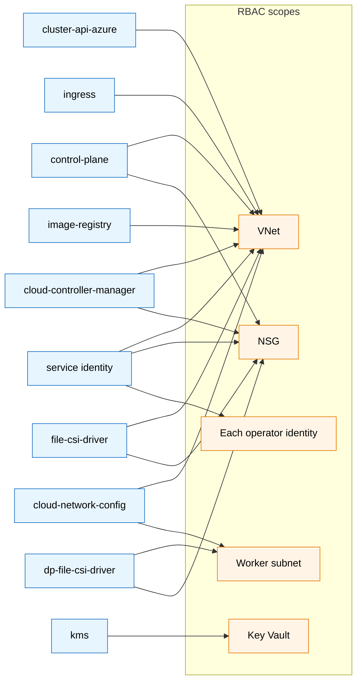

## Cluster ARM resource

Created in the customer RG:

```text
/subscriptions/<sub>/resourceGroups/my-cluster-rg/providers/Microsoft.RedHatOpenShift/hcpOpenShiftClusters/my-cluster
```

API version: `2026-06-30-preview`.

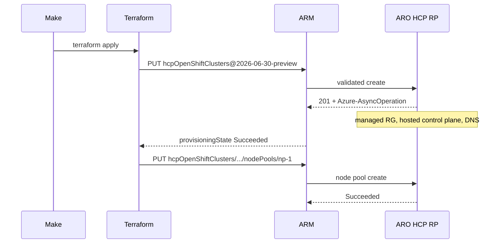

AzAPI body in [`modules/cluster/cluster.tf`](../modules/cluster/cluster.tf) (`schema_validation_enabled = false`, create/delete timeouts 120m):

| Property | Value |
|----------|--------|
| `name` / `location` | `cluster_name` / `location` |
| `properties.version.id` / `channelGroup` | `cluster_version` / `cluster_channel`. Plan fails unless `cluster_version` is an enabled stream in `hcpOpenShiftVersions` for `location`. |
| `platform.subnetId` | Worker subnet |
| `platform.vnetIntegrationSubnetId` | AzAPI integration subnet |
| `platform.networkSecurityGroupId` | Customer NSG |
| `platform.managedResourceGroup` | `managed_resource_group_name` |
| `platform.outboundType` | `LoadBalancer` |
| `etcd` KMS | Customer-managed; vault visibility Public |
| `api.visibility` | `Public` (or `api_visibility`) |
| `ingress.type` | `Public` (or `ingress_visibility`: Public, Private, Disabled) |
| identity + `operatorsAuthentication` | Service + 9 CP identities; DP map; service MI |

ARM properties always set (not left to RP defaults):

| Property | Default |
|----------|---------|
| `network.networkType` | `OVNKubernetes` |
| `network.podCidr` | `10.128.0.0/14` |
| `network.serviceCidr` | `172.30.0.0/16` |
| `network.machineCidr` | `10.0.0.0/16` |
| `network.hostPrefix` | `23` |
| `api.visibility` | `Public` unless `api_visibility = "Private"` |
| `ingress.type` | `Public` unless `ingress_visibility` is `Private` or `Disabled` |
| `platform.outboundType` | `LoadBalancer` |
| `clusterImageRegistry.state` | `Enabled` |

Create is idempotent: Terraform apply is a no-op when state matches.

Useful read-back fields after `Succeeded` (Terraform outputs `api_url` / `console_url` from `response_export_values`):

| Field | Meaning |
|-------|---------|
| `properties.provisioningState` | Cluster ARM state |
| `properties.api.url` | Kubernetes API |
| `properties.console.url` | OpenShift console; Entra redirect is this URL + `/auth/callback` |
| `properties.dns` | Customer-facing DNS (API / apps) filled by the service |

## Default node pool

Child resource:

```text
.../hcpOpenShiftClusters/my-cluster/nodePools/np-1
```

| Property | Default (`clusters/public/terraform.tfvars`) |
|----------|----------------------------------|
| Name | `np-1` |
| Replicas | `2`. Or set `min_replicas` and `max_replicas` together (CLI autoscaling; ARM omits `replicas`). |
| VM size | `Standard_D4s_v6` |
| Availability zone | `1` (`availability_zone`). Azure zone number, not a Kubernetes topology name (`uksouth-1`). Omit to leave the pool unpinned — ARO HCP is one zone per pool; replicas are not spread across zones. |
| Subnet | Unset unless `subnet_id` is set (CLI `--subnet-id`). The service uses the cluster worker subnet. Same subnet can be shared by pools of one cluster. |
| Version / channel | Inherited from `node_pool_version` / `node_pool_channel` when omitted. Plan fails unless the patch is enabled in `hcpOpenShiftVersions` for `location`. |
| OS disk | Unset unless `disk_size_gib`, `disk_storage_account_type`, `disk_type`, or `disk_encryption_set` is set. Service defaults apply. |
| Auto-repair / encryption-at-host / drain timeout | Unset unless specified (`node_drain_timeout` 0–10080 minutes). |
| Labels / taints | Optional. Labels are a Terraform map, sent as ARM `[{key,value}]`. Taint `effect` is `NoSchedule`, `PreferNoSchedule`, or `NoExecute`. |

OS disk, autoscaling, taints, and the other CLI create flags are fields on each `node_pools` entry. Extra pools go in the same map (see [`clusters/aro-virt`](../clusters/aro-virt/)); `NAME=… REPLICAS=… VM_SIZE=… bash scripts/nodepool.sh create` remains a one-off CLI.

### OpenShift Virtualization workers (`clusters/aro-virt`)

Microsoft supports CNV on ARO only on **Dsv5 / Dsv6 with 8+ cores** (Azure Boost). Keep `np-1` (`Standard_D4s_v6`) for platform pods. `clusters/aro-virt/terraform.tfvars` adds `np-virt` in `node_pools`:

```hcl
np-virt = {
  vm_size           = "Standard_D8s_v6"
  replicas          = 2
  availability_zone = "1"
  labels = {
    workload   = "virtualization"
    bgp_router = "true"
  }
}
```

Quota: **+16 vCPU** Dsv6. Do not taint unless HyperConverged and virt-handler have matching tolerations. `bgp_router=true` marks these nodes as CUDN BGP speakers for the sibling Azure Route Server path (shared with CNV in this example). Production can keep a small speaker pool (Route Server **16 BGP peers** max) and run CUDN/VMs elsewhere if those NICs have `enableIPForwarding` (operator [RFE #121](https://github.com/openshift/bgp-cloud-connector/issues/121); sibling DS until then). Sibling GitOps sample `BGPRouting` `virt` advertises `192.168.100.0/24` (operator creates the CUDN; workloads in namespace `virt`). Operator path: [Virt stack](guides/virt-stack.md) (`make cluster.aro-virt.platform` then the sibling). Cluster ARM delete cascades extra pools after destroy state-rms Terraform `nodePools`.

Worker VMs and disks appear in the **managed** RG. Their NICs attach to `${cluster_name}-worker` (`my-cluster-worker` in the example). CUDN BGP needs `enableIPForwarding` on those NICs; the sibling operator token-exchanges as `cluster-api-azure` (see [Identities and RBAC](#identities-and-rbac) and [#20](https://github.com/rh-mobb/validated-pattern-aro-hcp/issues/20)).

## Managed resource group

Created by the resource provider when the cluster is created. Named `managed_resource_group_name` (default `${cluster_name}-managed`). Must be unique in the subscription.

Typical contents after the default node pool is ready (names are service-generated):

| Kind | Why it exists |
|------|----------------|
| Deny assignment | Prevents customer principals from mutating RP-owned objects. Delete the **cluster**, not this RG. |
| Virtual machines | One per node-pool replica. |
| NICs | Attached to the customer worker subnet. |
| OS disks | Backing disks for workers. |
| Load balancer + public IP | `outboundType: LoadBalancer`. |
| DNS zone | Delegated apps zone; wildcard for `*.apps…` ingress. |
| Additional role assignments | RP/HyperShift identities operating on this RG (on the order of a dozen; not defined in this repo). |
| RH-managed NSG association | Service may associate an NSG with the worker subnet for platform traffic. |

Do not run `az group delete` on the managed RG. `az aro hcp cluster delete` (via `make cluster.<name>.destroy`) removes the cluster, node pools, and then the managed RG.

The hosted control plane (kube-apiserver, etcd, OAuth, console backend, operators) runs on the service management cluster. It is **not** listed in either customer resource group.

## Credentials and optional Entra

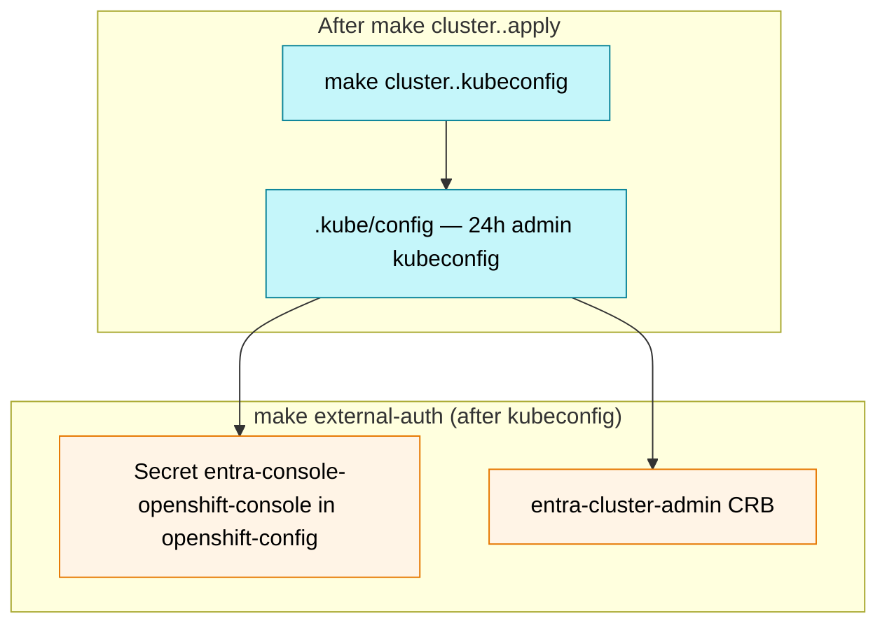

### Admin kubeconfig

`scripts/credentials.sh request` prefers `az aro hcp cluster request-credential --admin`, then falls back to REST `requestAdminCredential` (`2026-06-30-preview`). Output path: `KUBECONFIG_PATH` (default `.kube/config`). Revoke with `make revoke-credentials`. This does not create a durable Azure resource.

### External authentication

Terraform (`modules/entra`, after the cluster resource) creates the Entra app, service principal, confidential client secret in Key Vault, and `externalAuths/entra`. The deploying identity is set as **app and service-principal owner**. Microsoft Graph can otherwise create an app with **no owners**, after which `Application.ReadWrite.OwnedBy` cannot add a client secret, create the enterprise app, or delete the registration.

Redirect URIs are built from cluster DNS:

- **Always:** console `/auth/callback`, GitOps `/auth/callback`, Web `http://localhost:8000`, public-client `http://localhost` (PKCE)
- **Optional** `oidc_web_redirects` (default includes RHOAI `rh-ai` + `/oauth2/callback`). Set `{}` for none.

`make cluster.<name>.external-auth` (after kubeconfig) does **not** create or rotate the app when Terraform already owns it. It:

1. Reads the client secret from Key Vault and applies `openshift-config` secret `entra-console-openshift-console`.
2. If Argo CD is already installed, copies that secret into `openshift-gitops/argocd-secret` and patches `ArgoCD/openshift-gitops` for Entra OIDC (no Dex).
3. Binds the signed-in Entra user as OpenShift `cluster-admin` (`entra-cluster-admin`) unless `SKIP_RBAC_USER=1`. `GROUP_ID=` still applies `entra-cluster-admin-group`. Fleet group admins belong in a cluster-config GitOps overlay.

If `enable_external_auth = false`, the script falls back to creating the Entra app and ARM child as before.

Without the console secret, ClusterOperator `console` is typically degraded (HTTP 503 / “Application is not available”). Run kubeconfig then `make cluster.<name>.external-auth`.

Helpers on `scripts/external-auth.sh`: `login` (`oc-oidc`), `rbac-user`, `rbac-group`.

## GitOps (optional)

`make cluster.<name>.bootstrap` after kubeconfig. Operator guide: **[GitOps bootstrap](guides/gitops.md)**.

Terraform does not own in-cluster operators. Bootstrap:

1. Ensures `kube-system/additional-pull-secret` (from `PULL_SECRET_PATH`, else Key Vault `redhat-pull-secret`) and waits for HCCO `global-pull-secret`.
2. Applies [`gitops/bootstrap/`](../gitops/bootstrap/) (OpenShift GitOps `Subscription`, channel `gitops-1.19`, `installPlanApproval: Automatic`).
3. Waits for the CSV and the default Argo CD instance (`openshift-gitops`).
4. Publishes ConfigMap `openshift-gitops/aro-platform-metadata` from Terraform outputs (`esoClientId`, `azureTenantId`, `keyVaultUri`, `keyVaultName`, `pullSecretKeyVaultSecretName`). Same handshake as ROSA `rosa-platform-metadata`.
5. Applies [`gitops/overlays/<profile>/`](../gitops/overlays/) (Web Terminal, Compliance Operator, External Secrets Operator). Compliance `Subscription.spec.config` sets `nodeSelector` to `node-role.kubernetes.io/worker` and `PLATFORM=HyperShift` so the operator can schedule on HCP (the CSV otherwise selects master nodes). A Job waits for the ConfigMap, annotates `external-secrets-sa`, and applies `ClusterSecretStore` plus `ExternalSecret` for `additional-pull-secret`.
6. Plants Argo `Application` `cluster-config` (`prune: false`) pointing at `GITOPS_REPO` (default this repo, path `GITOPS_SOURCE_ROOT`/`overlay`). A cluster-config repo uses `GITOPS_SOURCE_ROOT=overlays` and Kustomize-includes this tree as a remote base. `ignoreDifferences` on ServiceAccount annotations / `imagePullSecrets` / `secrets` so selfHeal does not fight OpenShift dockercfg or the ESO metadata Job (the default GitOps controller cannot patch ServiceAccounts). The virt/storage sibling overlay binds `cluster-admin` to that controller (`rwx-storage-gitops-controller`) so Argo can create Trident ServiceAccounts, `VolumeSnapshotClass`, `TridentOrchestrator`, and `HyperConverged`.
7. If external-auth already ran: merge the GitOps `/auth/callback` redirect URI, copy the console client secret into `argocd-secret`, and patch the default `ArgoCD/openshift-gitops` CR for Entra OIDC (disable Dex). Skip with a log line when `.external-auth/state.env` or the console secret is missing.

HCP has no in-cluster OAuth server. The operator default (`spec.sso.dex.openShiftOAuth: true`) cannot authenticate GitOps users; do not GitOps-own a second Argo CD instance to fix that — patch the prebuilt CR from bootstrap. Client ID and secret stay out of committed `gitops/` YAML.

Public and private overlays are the same baseline today. Private API still needs sshuttle before `oc`. Do not install the same operators from Software Catalog.

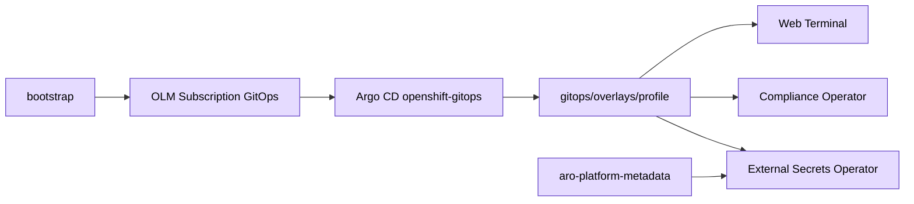


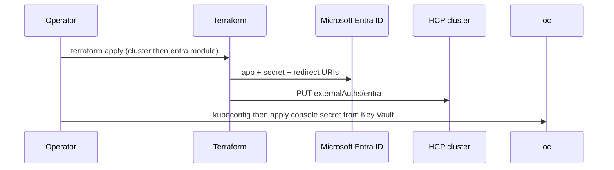

## Lifecycle

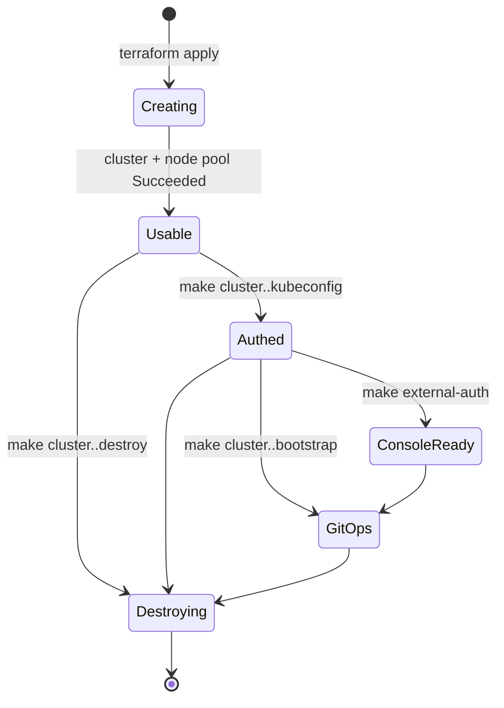

`make cluster.<name>.destroy` order:

0. If a sibling ANF/Trident stack is attached, destroy **that** first (its cleanup script, then its terraform destroy). This installer does not call the sibling.
1. `terraform state rm` default node pool — OCPBUGS-86702: RP rejects DELETE of the last pool
2. `terraform destroy` — Entra app + `externalAuths/entra` (when Terraform owns them), cluster ARM delete (cascades remaining pools and the managed RG), then customer RG contents

`external-auth-delete` only removes the in-cluster console secret when Terraform owns Entra. Do not `az ad app delete` a Terraform-managed app by hand.

When OCPBUGS-86702 is fixed and the frontend admission 409 is removed, step 1 can be dropped.

Do not `terraform destroy` the customer RG while the cluster still exists in Azure; that fails or orphans the managed RG. Plain `terraform destroy` without the state-rm also 409s on the last pool.

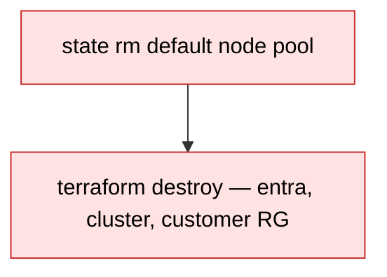

## Ownership matrix

| Resource | Created by | Destroyed by | Customer-writable |
|----------|------------|--------------|-------------------|
| Customer RG, VNet, subnets, NSG, KV, identities, operator RBAC | Terraform | `terraform destroy` | Yes |
| `hcpOpenShiftClusters` / `nodePools` | Terraform AzAPI (`node_pools`) | `make cluster.<name>.destroy` (state-rm all TF pools, then destroy) | Update via TF/ARM; do not hand-edit RP fields |
| Managed RG contents | Resource provider / HyperShift | Cluster delete | No (deny assignment) |
| Hosted control plane | ARO HCP service | Cluster delete | No |
| Admin kubeconfig | Credential API | Expires (24h) or `revoke-credentials` | Local file only |
| Entra app + Key Vault client secret | Terraform `modules/entra` | `terraform destroy` | Yes; lives in the tenant + customer KV |
| `externalAuths/entra` | Terraform AzAPI | `terraform destroy` | Via TF |
| Console secret in `openshift-config` | `oc apply` (`external-auth.sh`) | `oc delete` / cluster delete | Yes, in-cluster |
| GitOps / Web Terminal / Compliance / ESO Subscriptions | `cluster.<name>.bootstrap` then Argo | Delete Subscriptions / uninstall from console; not Terraform | Yes, in-cluster |
| `openshift-gitops/aro-platform-metadata` | bootstrap from Terraform outputs | `oc delete`; overwritten on next bootstrap | Yes, in-cluster |
| GitOps Entra OIDC (`ArgoCD` `oidcConfig` + `argocd-secret` key) | bootstrap or external-auth when both exist | Next bootstrap / external-auth overwrite; Entra app delete breaks login | Yes, in-cluster; secret copied from console secret |
| `kube-system/additional-pull-secret` | bootstrap from Key Vault or `PULL_SECRET_PATH`; ESO refreshes | `oc delete`; not Terraform | Yes, in-cluster (HCCO merges to kubelet) |

## Related repo files

| Path | Role |
|------|------|
| [`terraform/`](../terraform/) | Thin root: module composition + optional jumpbox |
| [`modules/network/`](../modules/network/) | RG, VNet, NSG, subnets |
| [`modules/identities/`](../modules/identities/) | Key Vault, etcd key, optional pull-secret KV secret, 13 HCP MIs + ESO identity, RBAC |
| [`modules/entra/`](../modules/entra/) | Entra app, redirect URI catalog, KV client secret, `externalAuths/entra` |
| [`modules/cluster/`](../modules/cluster/) | AzAPI `hcpOpenShiftClusters` + default `nodePools` |
| [`modules/jumpbox/`](../modules/jumpbox/) | Optional Fedora jump VM |
| [`hack/versions/`](../hack/versions/) | Tiny Terraform root for `make cluster.<name>.versions` |
| [`terraform/jumpbox.tf`](../terraform/jumpbox.tf) | Root jumpbox wiring (`enable_jumpbox`) |
| [`clusters/`](../clusters/) | Per-cluster `terraform.tfvars` + state |
| [`scripts/destroy.sh`](../scripts/destroy.sh) | State-rm last pool then terraform destroy |
| [`scripts/cluster.sh`](../scripts/cluster.sh) | Optional CLI cluster show/update/delete |
| [`scripts/jump.sh`](../scripts/jump.sh) | Jump SSH keygen, sshuttle connect/disconnect, foreground command |
| [`scripts/nodepool.sh`](../scripts/nodepool.sh) | Extra node pool lifecycle |
| [`scripts/credentials.sh`](../scripts/credentials.sh) | Admin kubeconfig |
| [`scripts/external-auth.sh`](../scripts/external-auth.sh) | Entra + external-auth |
| [`gitops/`](../gitops/) | Optional GitOps Kustomize + operator Subscriptions |
| [`scripts/gitops-bootstrap.sh`](../scripts/gitops-bootstrap.sh) | Install GitOps operator and plant root Argo Application |
| [`clusters/public/terraform.tfvars`](../clusters/public/terraform.tfvars) | Names and versions |
| [`AGENTS.md`](../AGENTS.md) | Source precedence when docs disagree |
| [`README.md`](../README.md) | Operator quickstart |
