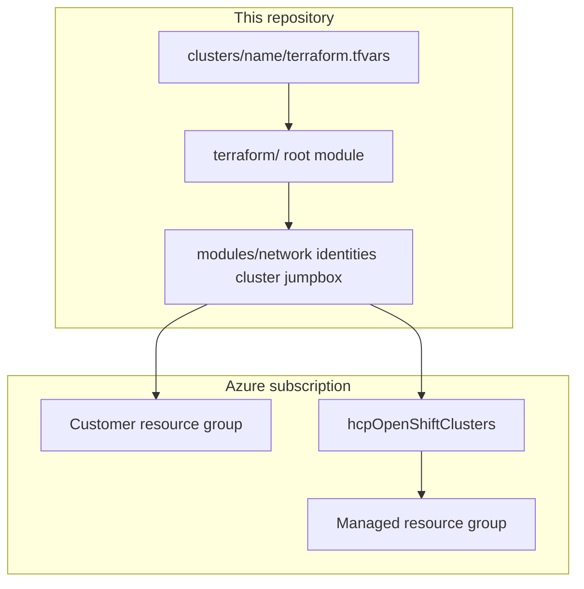

# ARO HCP Reference Deployment

Reference Terraform and scripts for deploying **Azure Red Hat OpenShift Hosted Control Plane (ARO HCP)** on Azure (`2026-06-30-preview` API).

This repository uses reusable Terraform modules and a **directory-per-cluster** pattern (`clusters/<name>/terraform.tfvars`) for state isolation and lifecycle management.

## Documentation map

| I want to… | Start here |
|------------|------------|
| Deploy my first cluster quickly | [Quick Start](getting-started/quick-start.md) |
| Verify subscription, RBAC, and quota | [Account Prerequisites](prerequisites/account.md) |
| See least-privilege permissions per `make` target | [Full-Stack Deployment — permissions by step](prerequisites/full-stack.md#permissions-by-deployment-step) |
| Configure Entra console OIDC | [External Auth with Entra ID](guides/external-auth-entra-id.md) |
| Bootstrap GitOps and day-2 operators | [GitOps bootstrap](guides/gitops.md) |
| Inspect Azure resources, RBAC scopes, and diagrams | [Architecture](architecture.md) |
| Network privacy (RFC1918 / Private Endpoints) | [Architecture — Network privacy](architecture.md#network-privacy) |
| Deploy ARO + OpenShift Virtualization (ANF + CNV) | [Virt stack](guides/virt-stack.md) — two checkouts, `clusters/aro-virt`, sibling apply/bootstrap |
| Deploy virt E2E with a local AI agent | [Quick start — OpenShift Virtualization](getting-started/quick-start.md#openshift-virtualization-validated-full-stack) (clone both repos; agent follows `AGENTS.md` + `clusters/aro-virt/AGENTS.md`) |
| Choose cluster profiles (public vs private) | [Cluster configurations](../clusters/README.md) |

## Architecture at a glance



## Example cluster profiles

| Profile | Example directory | Typical use |
|---------|-------------------|-------------|
| Public API + ingress | `clusters/public/` | Development, public console |
| Private API + ingress + jump | `clusters/private/` | RFC1918 API/ingress into the VNet; sshuttle via jump box |
| ARO + OpenShift Virtualization | `clusters/aro-virt/` | Same as public, plus `node_pools.np-virt` (Dsv6 Azure Boost, 8+ cores) and sibling ANF/CNV |

## Local preview

```bash
pip install -r requirements-docs.txt
make docs-preview
```

Open [http://127.0.0.1:8000/validated-pattern-aro-hcp/](http://127.0.0.1:8000/validated-pattern-aro-hcp/).

## Related

- [GitHub repository](https://github.com/rh-mobb/validated-pattern-aro-hcp)
