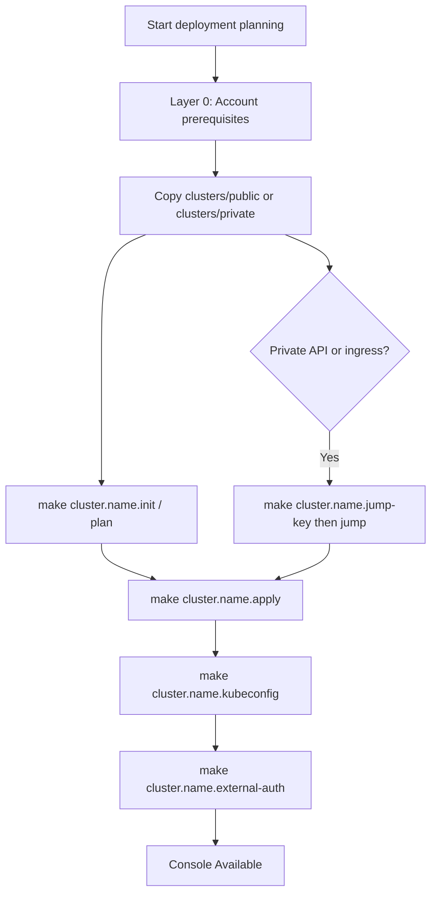

# Prerequisites — Choose Your Path

Before deploying an ARO HCP cluster from this repository, confirm **subscription enrollment**, **Azure RBAC**, and (for a usable console) **Entra directory** rights.

## One deployment path today

This reference implements **full-stack deployment**: one platform team runs Terraform for network, identities, cluster, and default node pool, then optional bash wrappers for credentials and external-auth.

| Layer | Scope | Document |
|-------|-------|----------|
| **0 — Account** | Subscription allow-list, RBAC baseline, quotas, tools | [Account prerequisites](account.md) |
| **1 — Full-stack** | `clusters/<name>/terraform.tfvars` + `make cluster.<name>.*` | [Full-stack deployment](full-stack.md) |
| **2 — Console OIDC** | Entra app + external-auth (after kubeconfig) | [External auth with Entra ID](../guides/external-auth-entra-id.md) |
| **3 — Virt / RWX** | Second checkout: ANF + Trident + CNV + Route Server | [Virt stack](../guides/virt-stack.md) or [Quick start — AI-assisted virt E2E](../getting-started/quick-start.md#openshift-virtualization-validated-full-stack) |

Bring-your-own network or identities (pre-provisioned VNet, separate security team) is not a first-class module split in this repo. If you reuse existing Azure objects, extend RBAC at those scopes — see [Account prerequisites — scope](account.md#rbac-scope-and-least-privilege).

## Decision flow

## Related

- [Quick start](../getting-started/quick-start.md) — minimal command sequence
- [Architecture](../architecture.md) — resource inventory and service identity RBAC
- [Cluster configurations](../../clusters/README.md) — example `terraform.tfvars`
