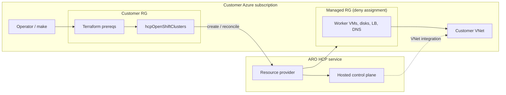
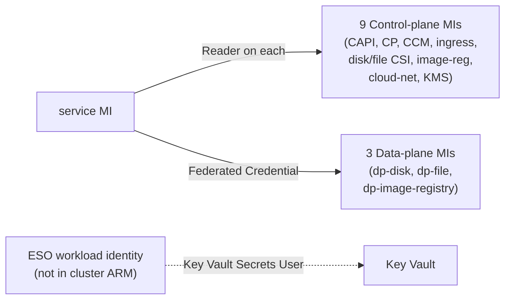
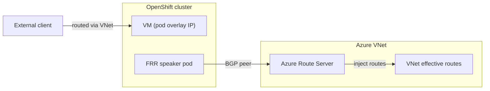
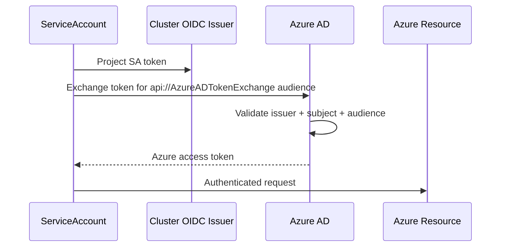
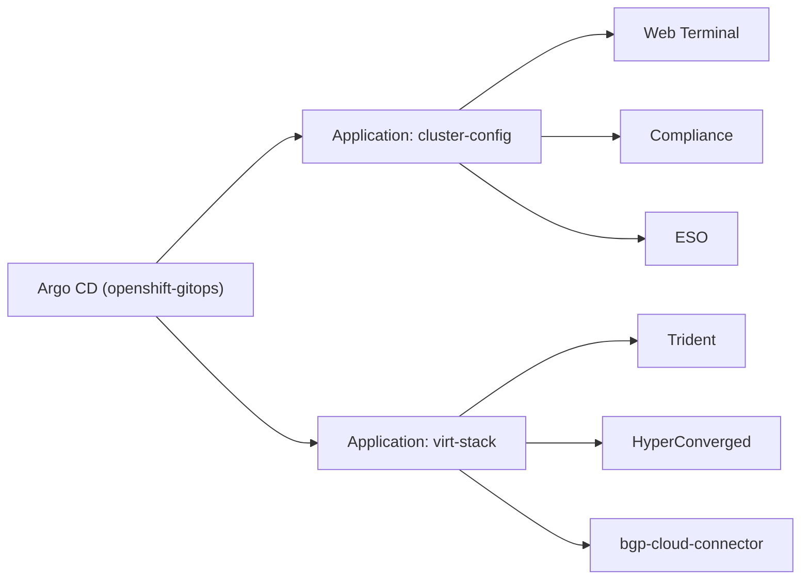

<div class="h-full flex flex-col items-center justify-center text-center">

# A Note on This Presentation

<div class="mt-6 max-w-2xl mx-auto text-[var(--rh-muted)] leading-relaxed">

This presentation was created with the assistance of AI. While the visuals are polished and the structure is sound, the content may contain inaccuracies. Please verify any technical claims, pricing figures, or roadmap dates before relying on them.

</div>

<div class="mt-8 text-xs text-[var(--rh-muted)] italic">

AI-assisted · verify before you trust

</div>

</div>

---

# ARO HCP + OpenShift Virtualization

## Architecture & Design Decisions

<div class="mt-8 text-[var(--rh-muted)]">
Internal Red Hat — September 2026
</div>

<!--
This deck covers the architecture of running OpenShift Virtualization on ARO HCP,
the design decisions we made, trade-offs we accepted, and gaps we're tracking.
-->

---

# The Problem

Running VMs on a managed OpenShift — without managing the control plane.


- Customers have **legacy workloads** (Windows, traditional app servers) that can't be containerized overnight
- They want a **unified platform** — VMs and containers, one API, one operations model
- They don't want to **self-manage** the control plane (patching, etcd backup, upgrades)
- **VMware licensing changes** are pushing customers to evaluate alternatives now


> **Goal:** A validated pattern for running OpenShift Virtualization on ARO HCP —
storage, networking, identity, GitOps — end to end.


<!--
VMware licensing changes are accelerating this conversation.
Customers who were "evaluating" are now "planning."
-->

---
layout: default
---

# Classic ARO vs ARO HCP — Why HCP?

<div class="text-sm text-[var(--rh-muted)] mb-2">

**ARO** — Azure Red Hat OpenShift · **HCP** — Hosted Control Plane (Microsoft runs the control plane; you run workers)

</div>

<RhTwoColumn>
<template #left>

### Classic ARO

- Control plane — 3x `Standard_D8s_v3` VMs in your Azure subscription (~$730/mo)
- Lifecycle — you patch upgrades and back up etcd (cluster state store)
- Roadmap — maintenance mode; security patches only
- Virtualization — OpenShift Virtualization (CNV); proven on Classic
- Network — worker nodes injected into your virtual network (VNet)
- Auth — built-in OpenShift OAuth server in the cluster

</template>
<template #right>

### ARO HCP

- Control plane — hosted by the ARO HCP service ($0 control-plane compute in your sub)
- Lifecycle — service-managed upgrades and etcd
- Roadmap — active development (external auth, CUDN, new API)
- Virtualization — CNV on Azure Boost (`Dsv5`/`Dsv6`, 8+ cores)
- Network — delegated VNet integration subnet (not full injection)
- Auth — Microsoft Entra ID via OpenID Connect (OIDC); no in-cluster OAuth

</template>
</RhTwoColumn>

- **Economics** — three large control-plane nodes add real cost, especially at scale
- **No day-0 tech debt** — deploying virtualization on Classic means migrating to HCP later, including live-migrating VMs
- **"Workarounds beat dead ends"** — HCP's rough edges today have a path forward; Classic's path is migrate to HCP anyway

<!--
ARO = Azure Red Hat OpenShift. HCP = Hosted Control Plane.
CNV = Container-Native Virtualization (the OpenShift Virtualization operator/product).
CUDN = Cluster User-Defined Network (OVN overlay + FRR speakers for routable VM/pod IPs on Azure).
etcd = distributed key-value store for Kubernetes/OpenShift cluster state.
Entra OIDC = Microsoft Entra ID as external identity provider (replaces in-cluster OAuth on HCP).
VNet = Azure virtual network. Azure Boost = hardware offload for networking/storage on select VM SKUs.

The trade-off is real: HCP is newer, preview API moves, some workarounds needed.
But temporary friction on an actively-developed platform beats permanent friction on one that won't get new capabilities.
-->

---
# Two-Repo Model

<div class="cols-2">
<div>

### This repo (installer)
- Cluster + GitOps baseline
- `make cluster.NAME.apply`
- Publishes `platform.json`

</div>
<div>

### Sibling (validated-pattern-openshift-virt)
- ANF + Trident + CNV + Route Server + BGP
- Reads `platform.json`
- Second checkout, second `make`

</div>
</div>


**Why two repos?**

- **Different lifecycles** — cluster outlives any single storage/virt config
- **Different owners** — platform team vs storage/virt team
- **Different destroy order** — sibling must destroy first (ANF cleanup needs a running cluster)
- **No coupling** — network team's firewall rules don't break our plan


<!--
Trying to put everything in one repo creates coupling that makes both sides brittle.
The sibling can source modules from this repo via git ref if it needs shared infra.
-->

---
# Trust Boundary




**The deny assignment on the managed RG is the root cause of the BGP identity workaround** (slide 13).


<!--
Control plane runs in the service. Managed RG has a deny assignment — customer can inspect but not mutate.
Worker NICs attach to the customer VNet. This matters for BGP later.
-->

---
# Network Layout

Six subnets, two repos.

| CIDR | Role | Created by |
|------|------|------------|
| `10.0.0.0/16` | VNet / machine CIDR | Installer |
| `10.0.0.0/24` | Worker subnet | Installer |
| `10.0.1.0/24` | VNet integration (delegated) | Installer |
| `10.0.2.0/28` | Jump subnet (optional) | Installer |
| `10.0.3.0/24` | ANF delegated subnet | **Sibling** (reserved by installer) |
| `10.0.4.0/26` | RouteServerSubnet | **Sibling** (reserved by installer) |


<strong>Design decision:</strong> Installer **reserves** CIDRs and validates no overlap at `plan` time.
Sibling creates the actual subnets.

Overlap validation uses numeric IPv4 range comparison (`cidrcontains()` needs TF 1.11; CI runs 1.9.8).


<!--
Pod CIDR 10.128.0.0/14 and Service CIDR 172.30.0.0/16 are ARM defaults.
-->

---
# Network Privacy — The Egress Gap

<RhTwoColumn>
<template #left>

### What HCP gives you today

- Private API — Yes
- Private ingress — Yes
- Private CP connectivity — Yes (RFC1918)
- Worker subnet — RFC1918
- Egress lockdown — Not yet

`outboundType = LoadBalancer` only. No UDR in HCP preview.

</template>
<template #right>

### How to handle the objection

- **Acknowledge it** — on the roadmap, not shipping today
- **Scope the exposure** — outbound-only SNAT; no inbound listeners when API+ingress are Private
- **Mitigate now** — NSG rules + Azure Firewall for visibility (logging), even without UDR
- **vs Classic** — building egress lockdown on Classic then rebuilding on HCP = double work
- **Bottom line:** Private + NSG + firewall logging now. UDR when HCP ships it.

</template>
</RhTwoColumn>

<!--
This is the most common pushback from security-conscious customers.
Classic ARO supports UserDefinedRouting. HCP will too, but not yet.
The public IP is outbound-only SNAT — nodes reaching registries, ARM, OIDC issuer. Not open inbound ports.
-->

---
# Network Privacy — RFC1918 / PE Compliance

<strong>Rule:</strong> All traffic this pattern owns must stay on RFC1918 or Azure Private Endpoints.

<div class="cols-2">
<div>

### Compliant (no exception)
- Worker / pod / service CIDRs
- HCP VNet integration subnet
- ANF NFS (delegated subnet, VNet IPs)
- Route Server BGP (`virtualRouterIps`)
- Jump NIC (RFC1918)

</div>
<div>

### Approved exceptions
- Public API/ingress (example profile)
- Node outbound (LoadBalancer)
- Key Vault (public, no PE yet)
- Jump public IP
- Route Server PIP (Azure-required)
- Entra ID (SaaS)
- ARM, image pulls

</div>
</div>


<strong>ANF is the model to copy:</strong> delegated subnet on the cluster VNet, volumes get VNet IPs. Not a Private Endpoint.


<!--
Every exception is documented in architecture.md. Any new public endpoint requires a new row in the same change.
-->

---
# Identity & RBAC

13 HCP managed identities + 1 ESO workload identity. 28 operator role assignments.




- **VNet-scoped** RBAC, not subnet — corrects older Bicep. CAPI/CCM/ingress need VNet-level access.
- No random suffix on MI names (unlike demo Bicep) — deterministic for automation.
- ESO identity is NOT attached to the cluster ARM resource — GitOps workload identity only.


<!--
The 14th identity (ESO) gets Key Vault Secrets User on the customer vault.
Two federated credentials: ESO and bgp-cloud-connector (covered in BGP slides).
-->

---
# Compute — Instance Choices for Virt

| Tier | Instances | How it works | Status |
|------|-----------|-------------|--------|
| Nested virt | Any Azure VM | Software hypervisor in guest | Available now |
| **Azure Boost** | **Dsv5/Dsv6 (8+ cores)** | **HW-accelerated net + storage** | **Current recommendation** |
| L1VH | New SKU family | CPU + memory scheduling handed to Azure host | TP ~Nov 2026, GA H1 2027 |


- **Nested virt is not the boogeyman** — most real migration targets are old Windows, legacy app servers. Not compute-bound. Fine on nested virt.
- **Azure Boost** (Dsv5/Dsv6 8+ cores) is Microsoft's supported path for CNV on ARO today. That's `np-virt`.
- **L1VH is for the hard cases** — big data, massive legacy apps that genuinely demand raw CPU. Bypasses OpenShift software layer entirely.
- **Start migrating now on Boost.** When L1VH GAs, use it for compute-heavy workloads. No need to wait.
- **Architecture is instance-agnostic** — swap the `np-virt` SKU. Storage, BGP, identity, GitOps don't change.


<!--
L1VH: Level 1 Virtual Hypervisor. Tech Preview at Microsoft Ignite ~November 2026.
GA targeted H1 2027. ARO support expected to follow.
-->

---
# Storage — Why ANF for Virt?

| Option | RWX | Live Migration | Licensing | Cross-cloud |
|--------|-----|----------------|-----------|-------------|
| Azure Files (NFS) | Yes | Latency concerns | Included | Azure only |
| Portworx | Yes | Yes | **Extra license ($$)** | All 3 |
| ODF (Ceph) | Yes | Yes | OCP entitlement | All 3 |
| **Azure NetApp Files** | **Yes** | **Yes** | **Azure native** | **All 3** |


- **Performance** — NFS on bare-metal NetApp in Azure. Block-level latency profile suitable for VM disks.
- **No extra licensing** — consumed as an Azure service, billed by capacity pool.
- **Cross-cloud portability** — NetApp ONTAP is a native service on all three hyperscalers: ANF (Azure), FSxN (AWS), Cloud Volumes Service (GCP). Same Trident CSI everywhere. Pattern transfers.
- **VNet-native** — delegated subnet, RFC1918. Not a Private Endpoint.


<strong>StorageClass design:</strong> `anf-virt` (virt-class annotation) for CNV. `managed-csi` stays default. CNV uses ANF automatically via `storageclass.kubevirt.io/is-default-virt-class`.


<!--
ANF minimum is a 1 TiB Standard capacity pool. Flex service level helps scale capacity without over-provisioning performance.
-->

---
# BGP — Why Azure Route Server?

<strong>Problem:</strong> VMs on OpenShift Virt need routable IPs. Pod overlay IPs are not routable from the Azure network.




- **CUDN** (Cluster User-Defined Network) + **FRR** speakers + **Azure Route Server**
- FRR pods on speaker nodes peer with Route Server
- Advertise pod CIDRs into Azure VNet routing
- Route Server is **BGP-only** — no data-plane forwarding. It injects routes into VNet effective routes.
- External traffic routes directly to pods via learned routes


<!--
Azure Route Server has two BGP endpoints (virtualRouterIps) — that's why two speakers is the natural minimum.
-->

---
# BGP — The Managed RG Problem

Speaker nodes need `enableIPForwarding` on their NICs.


<strong>But:</strong> Worker NICs live in the **managed RG** behind an RP **deny assignment**.

A customer-created MI **cannot** patch resources in the managed RG.


<strong>Solution:</strong> Federated credential on `cluster-api-azure` identity — the RP already trusts it there.

| Field | Value |
|-------|-------|
| Federated credential | `capi-bgp-cloud-connector` |
| Identity | `cluster-api-azure` (existing HCP MI) |
| Subject | `system:serviceaccount:openshift-bgp-cloud-connector:openshift-bgp-cloud-connector-controller-manager` |
| Audience | `api://AzureADTokenExchange` |


<strong>Blast radius:</strong> The operator can act as **full CAPI** in the managed RG (VMs, NICs, disks), not only IP forwarding.

This is a conscious trade-off: working BGP now vs perfect least-privilege later.

Tracked: **[#20](https://github.com/rh-mobb/validated-pattern-aro-hcp/issues/20)** — tighter identity.


<!--
We don't create a 14th customer MI. We reuse the one the RP already trusts.
The blast radius is real but tracked. The alternative is no BGP.
-->

---
# BGP — Speaker Placement

<RhTwoColumn>
<template #left>

### Demo (this pattern)

- Shared `np-virt` pool
- Label `bgp_router=true`
- Virt nodes run both VMs and FRR
- 2 nodes = 2 Route Server peers

</template>
<template #right>

### Production recommendation

- Dedicated speaker pool
- Cheaper non-CNV SKU (no 8-core Boost needed for FRR)
- IP forwarding and FRR stay off VM workers
- Scale virt without adding Route Server peers
- Route Server has 2 BGP endpoints — matches 2 speakers naturally

</template>
</RhTwoColumn>

```hcl
np-virt = {
  vm_size           = "Standard_D8s_v6"
  replicas          = 2
  availability_zone = "1"
  labels = {
    workload   = "virtualization"
    bgp_router = "true"
  }
}
```


<!--
Don't taint np-virt unless HyperConverged and virt-handler have matching tolerations.
-->

---
# Security — etcd KMS

Customer-managed Key Vault with RSA 2048 key.

| Setting | Value |
|---------|-------|
| `keyManagementMode` | `CustomerManaged` |
| `encryptionType` | `KMS` |
| `kms.vaultName` | `cust-kv-xxxxxxxxxxxx` |
| `kms.visibility` | `Public` |
| `kms.activeKey.name` | `etcd-data-kms-encryption-key` |


- KMS identity (`${cluster_name}-kms`) has **Key Vault Crypto User** on the vault
- Cluster resource depends on that assignment — created only after RBAC exists
- **Public vault** is a documented exception. PE is possible but not in this pattern.
- Optional **Red Hat pull secret** in Key Vault — ESO refreshes it via workload identity. No long-lived secrets in cluster.
- Terraform sets `purge_soft_delete_on_destroy = true` so destroy can purge the vault


<!--
Demo Bicep can private-link the vault. This repo sets kms.visibility: Public.
That's a row in the network privacy exception table.
-->

---
# Security — Workload Identity Federation

No long-lived secrets. Token exchange everywhere.




<strong>Two federated credentials in this pattern:</strong>

| Credential | Identity | Purpose |
|------------|----------|---------|
| `eso-external-secrets` | ESO | Key Vault Secrets User (pull secret refresh) |
| `capi-bgp-cloud-connector` | cluster-api-azure | NIC IP forwarding in managed RG |


<!--
No client secrets stored anywhere. The OIDC issuer is the cluster's own issuer URL, available after cluster create.
-->

---
# Security — Entra OIDC

HCP has **no in-cluster OAuth server**. External auth via Microsoft Entra ID.


- **Application Developer** role is sufficient — not Global Admin, not Application Administrator
- If users can register applications (common default): no directory role needed at all
- Terraform owns the app lifecycle: create, redirect URIs, client secret in Key Vault, externalAuths entra ARM child
- Console is **HTTP 503** until `make cluster.NAME.external-auth` applies the console secret


### Redirect URI catalog

- `https://{console}/auth/callback` — OpenShift console
- `https://{gitops}/auth/callback` — Argo CD
- `http://localhost:8000` — Web terminal
- `http://localhost` — `oc login` PKCE (public client)
- `https://rh-ai/oauth2/callback` — RHOAI (optional)


<!--
Dex doesn't work on HCP (no in-cluster OAuth). We patch the prebuilt ArgoCD CR for Entra OIDC directly.
-->

---
# GitOps — One Argo, Two Apps




- **Do NOT install a second Argo CD** — Dex doesn't work on HCP. Patch the prebuilt CR for Entra OIDC.
- **Controller RBAC escalation:** sibling binds `cluster-admin` to the GitOps controller so Argo can create Trident SAs, `VolumeSnapshotClass`, `TridentOrchestrator`, `HyperConverged`. Installer baseline does NOT. (tracked: virt [#6](https://github.com/rh-mobb/validated-pattern-openshift-virt/issues/6))
- **`ignoreDifferences`** on SA annotations / `imagePullSecrets` / `secrets` — OpenShift dockercfg and ESO metadata Job fight selfHeal otherwise.
- **Platform metadata handshake:** ConfigMap `aro-platform-metadata` (ESO client ID, vault URI). Same pattern as ROSA.


<!--
cluster-config and virt-stack are two Applications on the same controller.
-->

---
# Live Migration

ANF RWX storage is what enables live migration.


- **Azure Boost required:** Dsv5/Dsv6 with 8+ cores (Microsoft support requirement for CNV on ARO)
- **No taints** on virt nodes unless HyperConverged and virt-handler have matching tolerations
- **CDI clone/upload memory:** HyperConverged `storageWorkloads` (4Gi) prevents OOM on large images (default ~600M kills CDI pods at ~65%). GitOps owns this.
- **`anf-virt` StorageClass** with virt-class annotation — CNV uses it automatically for golden images and VM disks
- **First ANF volume** often takes 5-15 minutes (CSI may `DeadlineExceeded` then bind on retry — don't panic)


```yaml
spec:
  resourceRequirements:
    storageWorkloads:
      limits:
        memory: 4Gi
        cpu: "2"
      requests:
        memory: 1Gi
        cpu: "500m"
```


<!--
The CDI memory fix is the most common gotcha. Without it, large image clones OOM at 60-70%.
-->

---
hidden: true
---

# Upgrades with Running VMs

> **Placeholder — unhide when ARO HCP upgrade path is documented and validated.**

<strong>What we expect but cannot yet confirm:</strong>


- Node pool rolling update drains one node at a time
- Running VMs live-migrate off the draining node (requires RWX — ANF)
- VMs without live migration (no RWX, eviction strategy `None`) are shut down and restarted
- Cluster version upgrades (control plane) are service-managed
- Node pool version upgrades are customer-initiated (Terraform `node_pool_version` bump)


<strong>Open questions:</strong>
- PodDisruptionBudgets for `virt-launcher` pods during drain?
- Drain timeout behavior? (`node_drain_timeout` 0-10080 minutes)
- Version skew policy between cluster and node pool?
- In-flight live migrations during drain?


<!--
This slide is hidden by default. Unhide when upgrade behavior is validated on ARO HCP.
-->

---
# Migration Path — Getting VMs Here

<div class="cols-2">
<div>

### MTV (default)
Migration Toolkit for Virtualization

- Included with OpenShift Virt subscription
- Sources: VMware vSphere, RHV, OpenStack, OVA
- Warm migration (pre-copy + cutover)
- Discovery + assessment + planning
- Integrates with OpenShift console

</div>
<div>

### RiverMeadow (partner)
For sources MTV doesn't cover

- Validated: AWS VMC to ROSA Virt
- Expected: AVS or on-prem VMs to ARO Virt
- Adds cloud-to-cloud and P2V paths
- Commercial relationship

</div>
</div>


<strong>Common paths:</strong>

| Source | Tool | Target |
|--------|------|--------|
| VMware on-prem | MTV | ARO HCP Virt |
| Azure VMware Solution (AVS) | RiverMeadow | ARO HCP Virt |
| AWS VMware Cloud | RiverMeadow | ROSA Virt / ARO HCP Virt |
| Other hypervisors / cloud VMs | RiverMeadow | ARO HCP Virt |


<!--
RiverMeadow is especially interesting for customers on AVS who want to exit VMware licensing entirely.
-->

---
# DR / Backup

<div class="cols-2">
<div>

### VM Backup (standard OCP Virt story)

- **OADP** (Velero) for VM backup
- CSI snapshots via Trident (ANF volume snapshots)
- Application-consistent with pre/post hooks
- Backup target: Azure Blob Storage
- Not ANF-specific — same OADP as any OCP Virt cluster

</div>
<div>

### Disaster Recovery (customer-specific)

No single prescribed DR topology. Options:

- ANF cross-region replication (Azure-native)
- Portworx DR (if already licensed)
- Zerto / partner tooling
- GitOps rebuild + VM image restore

</div>
</div>


<strong>What we provide:</strong>
- A platform that's **backup-friendly** (CSI snapshots, RWX, standard OADP)
- A platform that's **reproducible** (`make cluster.NAME.apply` in a DR region with the same tfvars = identical platform)
- VM data restore is the customer-specific part


<!--
The installer pattern is fully reproducible via Terraform + GitOps.
Platform rebuild is fast. VM data restore is the hard part and is always customer-specific.
-->

---
# Cost Picture — Ballpark (PAYG List Pricing)

`clusters/aro-virt` profile — UK South, pay-as-you-go.

| Component | SKU / Tier | Qty | Notes |
|-----------|-----------|-----|-------|
| np-1 (platform) | Standard_D4s_v6 | 2 | Platform pods |
| np-virt (virt workers) | Standard_D8s_v6 | 2 | CNV + BGP speakers |
| ANF capacity pool | Standard, 1 TiB | 1 | Minimum pool size |
| Azure Route Server | Standard | 1 | Fixed cost |
| Key Vault | Standard | 1 | ~$3-5/mo |
| ARO HCP management fee | Per cluster | 1 | Preview pricing TBD |
| Outbound LB public IP | Standard static | 1 | ~$4/mo |


- **vs Classic:** subtract ~$730/mo for 3x CP nodes — partially offsets ANF + Route Server
- **ANF is the biggest new line item.** 1 TiB Standard pool minimum. Flex service level helps.
- **Route Server** is modest but fixed whether you have 2 or 20 speakers
- **Reserved Instances** (1yr/3yr) on Dsv6 cut compute 30-50%


<!--
Fill in actual list prices from Azure pricing calculator for the specific region before presenting.
What's NOT here: Azure Firewall, Bastion, Log Analytics, Entra P1/P2 — those are landing zone costs.
-->

---
# Platform Contract

`platform.json` — the handshake between repos.

<div class="cols-2">
<div>

### Installer publishes

- Cluster name, RG, location, subscription
- VNet ID, worker subnet ID
- OIDC issuer URL
- CAPI client ID (bgp-cloud-connector)
- ESO client ID, vault URI
- Reserved CIDRs (netapp, route server)

</div>
<div>

### Sibling consumes

- VNet ID for delegated subnet creation
- CAPI client ID for NIC IP forwarding
- OIDC issuer for its own federated credentials
- CIDRs for subnet creation

</div>
</div>


```bash
make cluster.aro-virt.platform    # writes clusters/aro-virt/platform.json (gitignored)
```

CIDR overlap preconditions validate at **plan time** — catch conflicts before any Azure resource is created.


<!--
platform.json is gitignored because it contains subscription IDs and resource IDs.
The sibling reads it via ARO_HCP_ROOT and ARO_HCP_PROFILE env vars.
-->

---
# Landing Zone Integration — What We Don't Build

| Component | Enterprise expectation | This repo |
|-----------|----------------------|-----------|
| Centralized egress | Hub VNet + shared firewall | Not ours — upstream cloud/network team |
| Hub/spoke peering | Spoke peered to hub | Our VNet is designed to **be** the spoke |
| Enterprise bastion | Azure Bastion + PAM + audit | Optional Fedora jump (dev convenience) |
| Private DNS zones | Hub-linked `privatelink` zones | We document records; network team creates |
| Log Analytics / SIEM | Centralized workspace | Cluster sends to whatever sink exists |
| Azure Policy | Subscription-level governance | We don't fight policy — we surface errors |


**Design philosophy: pluggable, not prescriptive.**

- This repo builds a **spoke**. Someone upstream owns the hub.
- That team has their own IaC, their own state, their own change management.
- We optimize for: **easy to peer**, **predictable CIDRs**, **no surprise public endpoints**, **`platform.json` for automation**.


<!--
The network privacy exception table is the conversation starter with the security team.
-->

---
# Deploy & Destroy Path

<div class="cols-2">
<div>

### Deploy (two shells, one kubeconfig)

<strong>Installer:</strong>
1. `make cluster.aro-virt.apply` (~30-60 min)
2. `make cluster.aro-virt.kubeconfig`
3. `make cluster.aro-virt.external-auth`
4. `make cluster.aro-virt.bootstrap`
5. `make cluster.aro-virt.platform`

<strong>Sibling:</strong>
1. `make cluster.aro-virt.apply` (ANF, Route Server)
2. `make cluster.aro-virt.bootstrap` (Argo Application)

</div>
<div>

### Destroy (order matters)

<strong>Sibling first:</strong>
1. BGP CR drain (operator cleans Azure peerings)
2. ANF PVC cleanup (180s timeout each)
3. `make cluster.aro-virt.destroy`

<strong>Then installer:</strong>
1. State-rm all Terraform `nodePools` (OCPBUGS-86702)
2. `make cluster.aro-virt.destroy`

</div>
</div>


**Why sibling first?** Trident cleanup needs the cluster running. ANF volume delete is slow — leftover volumes block capacity pool destroy. BGP CR drain needs the operator to clean Azure peerings.


<!--
OCPBUGS-86702: RP rejects DELETE of the last node pool. State-rm workaround until fixed.
-->

---
# Known Gaps & Follow-ups

| Gap | Status | Impact |
|-----|--------|--------|
| [#20](https://github.com/rh-mobb/validated-pattern-aro-hcp/issues/20) Least-privilege CAPI for BGP | Open | bgp-cloud-connector has full CAPI scope in managed RG |
| Private Key Vault | Not implemented | Public vault is a documented exception |
| Egress lockdown (UDR) | Platform roadmap | `outboundType = LoadBalancer` only today |
| Dedicated speaker pool | Documented recommendation | Demo shares virt nodes; production should separate |
| CDI uid/gid 107 | Separate from memory fix | KubeVirt needs uid/gid 107 on shared filesystem SCs |
| Argo controller tightening | [virt #6](https://github.com/rh-mobb/validated-pattern-openshift-virt/issues/6) | `cluster-admin` binding broader than needed |
| OCPBUGS-86702 last-pool delete | Platform bug | state-rm workaround in destroy |
| HCP upgrade path for VMs | Unvalidated | Hidden placeholder slide (20) |

<!--
Every gap either has a tracking issue or is a platform feature on the roadmap.
None are architectural dead ends — that's the point of choosing HCP.
-->

---
layout: center
class: text-center
---

# Q&A

<div class="text-center mt-8">

<strong>Repos:</strong>

[validated-pattern-aro-hcp](https://github.com/rh-mobb/validated-pattern-aro-hcp) (installer)

[validated-pattern-openshift-virt](https://github.com/rh-mobb/validated-pattern-openshift-virt) (sibling)

<strong>Docs:</strong> [rh-mobb.github.io/validated-pattern-aro-hcp](https://rh-mobb.github.io/validated-pattern-aro-hcp/)

</div>
