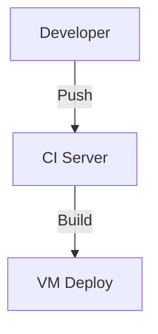
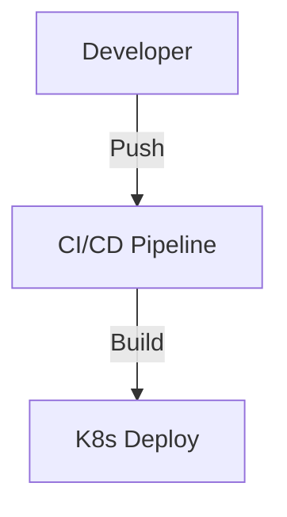
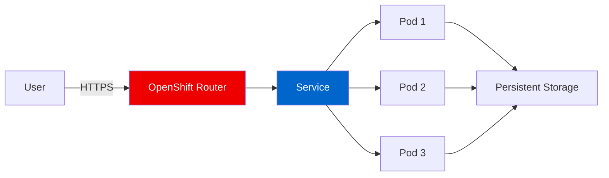

# Slidev Theme Red Hat
## Modern Presentations for Cloud-Native Teams

A Slidev theme implementing Red Hat brand standards for technical presentations, conference talks, and developer education.

<!--
Cover slide: title ≤2 lines (brand rule). Subtitle optional.
Presenter byline goes in a <div class="mt-8 text-[var(--rh-muted)]"> below.
-->

---
layout: intro
image: /speaker.png
---

# Paul Czarkowski
## Principal Solutions Architect

Red Hat Managed OpenShift Black Belt

- 15+ years in cloud infrastructure
- Open source contributor and community advocate
- Focus: Kubernetes, OpenShift, ROSA, ARO

<!--
Intro layout: image is set via frontmatter `image: /speaker.png`.
Photo is cropped to a circle by the layout. h1 = name, h2 = title, body = bio bullets.
-->

---
layout: default
---

# Typography & Content

The theme uses **Red Hat Display** for headings and **Red Hat Text** for body content, following official brand guidelines.

## Key Features

### Design Elements
- Clean, professional layouts
- Accessible color contrast
- Dark mode support

### Technical Capabilities
- Syntax highlighting for code
- Mermaid diagram support
- Interactive components

**Bold text** for emphasis, *italic* for subtle stress, and [hyperlinks](https://redhat.com) in brand red.

<!--
Default layout: left-aligned h1 with red left-border accent. Brand rule: title ≤1 line.
h2 renders as a red subheading. h3 renders as a bold section label.
-->

---
layout: two-cols
---

# Side-by-Side Comparison

## Self-Managed OpenShift

- Full control over infrastructure
- Custom configurations
- On-premises or cloud
- Requires dedicated ops team
- Manual upgrades and patches

::right::

## Managed OpenShift (ROSA)

- AWS-native managed service
- Red Hat SRE team included
- 99.95% SLA guarantee
- Automated updates
- Pay-as-you-go pricing

<!--
two-cols layout: h1 spans full width, then ::left:: and ::right:: split the body.
Use h2 inside each column to label it. Brand rule: 4-5 bullets per column max.
-->

---
layout: two-cols-header
---

# Development Workflow Architecture

::left::

### Traditional VM-Based



Manual scaling, slow deployments

::right::

### Cloud-Native Kubernetes



Declarative, automated, scalable

<!--
two-cols-header layout: h1 is the shared header, then ::left:: and ::right:: for content.
Good for before/after comparisons. Mermaid diagrams render directly in each column here.
-->

---
layout: section
---

# Code Examples
## Demonstrating Syntax Highlighting

<!--
Section/divider layout: h1 is the large left-aligned section label, h2 is the subtitle.
Brand rule: section text ≤3 lines. Full red background — no body content on this slide.
-->


---
layout: default
---

# Kubernetes Deployment

Here's how to deploy a simple application on OpenShift or Kubernetes:

```typescript {maxHeight:'320px'}
import * as k8s from '@kubernetes/client-node';

const deployment = {
  apiVersion: 'apps/v1',
  kind: 'Deployment',
  metadata: { name: 'web-app' },
  spec: {
    replicas: 3,
    selector: { matchLabels: { app: 'web' } },
    template: {
      metadata: { labels: { app: 'web' } },
      spec: {
        containers: [{
          name: 'frontend',
          image: 'quay.io/example/web:latest',
          ports: [{ containerPort: 8080 }]
        }]
      }
    }
  }
};
```

<!--
Default layout with code block. Use {maxHeight:'320px'} on the fence to prevent overflow.
lineNumbers: false globally; add {lines:true} per block to enable.
Brand rule: if the snippet is from an external source, add a muted caption below crediting it.
-->

---
layout: default
---

# Architecture Overview



Traffic flows through the OpenShift router to service endpoints, distributed across pods with shared persistent storage.

<!--
Mermaid diagrams render in default layout. Avoid inline fill/color styles — they break dark mode.
Use style statements or class definitions instead. Brand rule: add a source line if the architecture is from an external reference.
-->

---
layout: quote
---

# "Open source is the future of software, and it's the present."
## Jim Whitehurst
Former CEO, Red Hat

<!--
Quote layout: h1 is the quote text (include the quotation marks). h2 = attribution name. Body = title/org.
Brand rule: use for a single powerful external quote. Photo optional — set via `image:` frontmatter.
-->

---
layout: fact
---

# 90%
## of Fortune 500 companies use Red Hat solutions

<!--
Fact layout: h1 is the big number/stat, h2 is the supporting label. Use sparingly — one per section max.
Brand rule: always cite the source. If you can't name the source, don't use the stat.
-->

---
layout: statement
---

# The future is cloud-native, open, and collaborative

<!--
Statement layout: centered, large single line. No body content. Use for a bold closing thought or thesis statement.
Brand rule: ≤1 line. This is the most prominent text on the slide — make every word count.
-->

---
layout: image
image: https://images.unsplash.com/photo-1451187580459-43490279c0fa?w=1920
---

# Global Scale
## Red Hat OpenShift runs mission-critical workloads worldwide

<!--
Full-bleed image layout: image fills the slide, text overlays at the bottom.
Brand rule: keep text minimal — the image is the message. Use high-contrast text.
Photo source: Unsplash (check license before use in external presentations).
-->

---
layout: image-left
image: https://images.unsplash.com/photo-1558494949-ef010cbdcc31?w=960
---

# ROSA on AWS

## Red Hat OpenShift Service on AWS

Fully managed OpenShift clusters running natively on AWS infrastructure.

- Integrated with AWS services (RDS, S3, Route53)
- Red Hat SRE monitoring and support
- Pay through your AWS account
- Deploy in minutes, scale on demand

**Perfect for teams who want OpenShift without the operational overhead.**

<!--
image-left layout: photo on the left third, content on the right. Good for human + product stories.
Brand rule: use real photos from the Red Hat brand portal for official presentations, not stock photos.
-->

---
layout: image-right
image: https://images.unsplash.com/photo-1558494949-ef010cbdcc31?w=960
---

# Azure Red Hat OpenShift

## Enterprise Kubernetes on Azure

Co-engineered and jointly supported by Microsoft and Red Hat.

- Native Azure integration
- Private clusters available
- Compliance certifications
- 99.95% uptime SLA

**The trusted choice for regulated industries running on Azure.**

<!--
image-right layout: photo on the right third, content on the left. Mirror of image-left.
Use when the photo is secondary to the text, or for visual variety in a long deck.
-->

---
layout: center
---

# Key Takeaways

<v-clicks>

✅ **Cloud-native** is the standard for modern applications

✅ **Managed services** reduce operational complexity

✅ **Open source** drives innovation and avoids lock-in

✅ **Red Hat** provides enterprise-grade support and security

</v-clicks>

<!--
Center layout: all content is vertically and horizontally centered.
Good for key takeaway lists with v-clicks, or any content that benefits from breathing room.
Brand rule: use sparingly — one centered slide per major section at most.
-->

---
layout: end
---

# Thank You

## Let's Build the Future Together

📧 pczarkowski@redhat.com  
🐙 github.com/paulczar  
🌐 redhat.com/openshift

**Questions?**

<!--
End layout: closing slide with links and a call to action. h1 = "Thank you" or closing line.
Brand rule: include 2-3 links max. The official Red Hat closing slide adds social media icons — use the rh-tag class for link badges if needed.
-->
